<h1 align="center">Hinote 「火ノ手」</h1>

<div align="center">
  <table width="60%">
    <tr>
      <td style="vertical-align: top; padding-right: 20px;">
        <strong>Authors:</strong><br>
        Md. Farhan Ishraq<br>
        Md. Rezwan Azam<br>
        Mazharul Islam
      </td>
      <td style="vertical-align: top; padding-left: 20px;">
        <strong>Supervisor:</strong><br>
        Ishmam Tashdeed<br>
        Lecturer, Dept. of<br>
        CSE,<br>
        IUT
      </td>
    </tr>
  </table>
</div>

## Hinote is a collaborative drawing application built with JavaFX that includes:

### Core Features:

1.  **Real-time collaborative drawing** - Multiple users can draw together
2.  **Chat functionality** - Users can chat while collaborating
3.  **Room-based collaboration** - Users join rooms to work together
4.  **WebSocket communication** - Real-time updates between clients and server
5.  **Drawing tools** - Various drawing tools and colors
6.  **Text tools** - Add and edit text on the canvas
7.  **Theme support** - Light and dark themes

### Architecture:

-   **Client-Server Architecture** using WebSockets
-   **JavaFX** for the desktop UI
-   **Maven** for build management
-   **Jackson** for JSON processing
-   **WebSocket** for real-time communication

### Key Components:

-   [HinoteApplication.java](vscode-file://vscode-app/c:/Users/LENOVO/AppData/Local/Programs/Microsoft%20VS%20Code/resources/app/out/vs/code/electron-browser/workbench/workbench.html) - Main JavaFX application entry point
-   [HinoteServer.java](vscode-file://vscode-app/c:/Users/LENOVO/AppData/Local/Programs/Microsoft%20VS%20Code/resources/app/out/vs/code/electron-browser/workbench/workbench.html) - WebSocket server for handling multiple clients
-   [MainController.java](vscode-file://vscode-app/c:/Users/LENOVO/AppData/Local/Programs/Microsoft%20VS%20Code/resources/app/out/vs/code/electron-browser/workbench/workbench.html) - Main UI controller managing drawing canvas, tools, and chat
-   [ConnectionManager.java](vscode-file://vscode-app/c:/Users/LENOVO/AppData/Local/Programs/Microsoft%20VS%20Code/resources/app/out/vs/code/electron-browser/workbench/workbench.html) - Handles WebSocket client connections
-   Various models for [ChatMessage](vscode-file://vscode-app/c:/Users/LENOVO/AppData/Local/Programs/Microsoft%20VS%20Code/resources/app/out/vs/code/electron-browser/workbench/workbench.html), [DrawingOperation](vscode-file://vscode-app/c:/Users/LENOVO/AppData/Local/Programs/Microsoft%20VS%20Code/resources/app/out/vs/code/electron-browser/workbench/workbench.html), [TextOperation](vscode-file://vscode-app/c:/Users/LENOVO/AppData/Local/Programs/Microsoft%20VS%20Code/resources/app/out/vs/code/electron-browser/workbench/workbench.html), etc.
- How it works:

Client: Establish connection
Server: (keeps connection open)
Server: → Send update immediately when available
Client: → Send updates as they happen

- Custom message protocol (JSON) for sending and recieving updates from Server
- Example:
```JSON
// Client-side outgoing message format
{
  "type": "operation",
  "id": "unique-op-id",       // Client-generated unique ID
  "operation": {
    "type": "draw-line",
    "startX": 100, "startY": 100,
    "endX": 200, "endY": 200,
    "color": "#FF0000"
  },
  "timestamp": 1634567890000  // Client local timestamp
}
```
### Project Structure: 
```
hinote/
├── pom.xml
├── src/
│   ├── main/
│   │   ├── java/
│   │   │   └── com/
│   │   │       └── hinote/
│   │   │           ├── HinoteApplication.java
│   │   │           ├── client/
│   │   │           │   ├── HinoteClient.java
│   │   │           │   ├── ui/
│   │   │           │   │   ├── MainController.java
│   │   │           │   │   ├── components/
│   │   │           │   │   │   ├── ChatPanel.java
│   │   │           │   │   │   ├── DrawingCanvas.java
│   │   │           │   │   │   ├── ToolsPanel.java
│   │   │           │   │   │   ├── ParticipantsPanel.java
│   │   │           │   │   │   └── ColorPalette.java
│   │   │           │   │   └── dialogs/
│   │   │           │   │       ├── JoinRoomDialog.java
│   │   │           │   │       └── CreateRoomDialog.java
│   │   │           │   ├── network/
│   │   │           │   │   ├── WebSocketClient.java
│   │   │           │   │   ├── MessageHandler.java
│   │   │           │   │   └── ConnectionManager.java
│   │   │           │   └── models/
│   │   │           │       ├── Room.java
│   │   │           │       ├── User.java
│   │   │           │       ├── ChatMessage.java
│   │   │           │       ├── DrawingOperation.java
│   │   │           │       └── TextOperation.java
│   │   │           ├── server/
│   │   │           │   ├── HinoteServer.java
│   │   │           │   ├── handlers/
│   │   │           │   │   ├── WebSocketHandler.java
│   │   │           │   │   ├── RoomHandler.java
│   │   │           │   │   └── MessageRouter.java
│   │   │           │   ├── models/
│   │   │           │   │   ├── ServerRoom.java
│   │   │           │   │   ├── ConnectedUser.java
│   │   │           │   │   └── OperationHistory.java
│   │   │           │   └── services/
│   │   │           │       ├── RoomService.java
│   │   │           │       ├── UserService.java
│   │   │           │       └── SynchronizationService.java
│   │   │           ├── shared/
│   │   │           │   ├── protocol/
│   │   │           │   │   ├── Message.java
│   │   │           │   │   ├── MessageType.java
│   │   │           │   │   ├── ChatMessageProtocol.java
│   │   │           │   │   ├── DrawingOperationProtocol.java
│   │   │           │   │   ├── TextOperationProtocol.java
│   │   │           │   │   └── RoomProtocol.java
│   │   │           │   └── utils/
│   │   │           │       ├── JsonUtil.java
│   │   │           │       └── IdGenerator.java
│   │   │           └── config/
│   │   │               ├── ClientConfig.java
│   │   │               └── ServerConfig.java
│   │   └── resources/
│   │       ├── fxml/
│   │       │   ├── main.fxml
│   │       │   ├── chat-panel.fxml
│   │       │   ├── tools-panel.fxml
│   │       │   └── participants-panel.fxml
│   │       ├── css/
│   │       │   ├── light-theme.css
│   │       │   └── dark-theme.css
│   │       └── icons/
│   │           ├── brush.png
│   │           ├── pen.png
│   │           └── eraser.png
│   └── test/
│       └── java/
│           └── com/
│               └── hinote/
│                   ├── client/
│                   │   └── network/
│                   │       └── WebSocketClientTest.java
│                   ├── server/
│                   │   └── handlers/
│                   │       └── WebSocketHandlerTest.java
│                   └── shared/
│                       └── protocol/
│                           └── MessageTest.java

```
# Tutorial: Hinote

Hinote is a **real-time collaborative drawing application** that allows multiple users to *draw, chat, and add text* on a shared digital whiteboard. It ensures all participants see the same content by sending *standardized communication messages* between clients and a central server, managing the shared state of each collaborative 'room'.


## Visual Overview

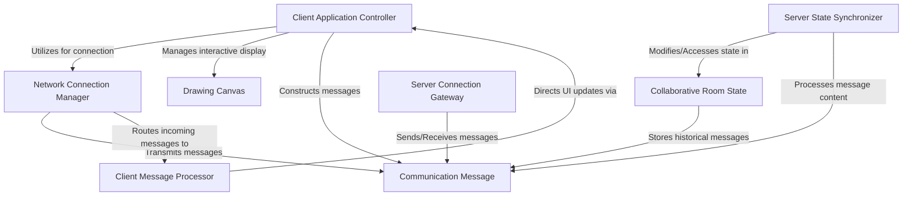

## Chapters

1. [Client Application Controller
](01_client_application_controller_.md)
2. [Drawing Canvas
](02_drawing_canvas_.md)
3. [Communication Message
](03_communication_message_.md)
4. [Network Connection Manager
](04_network_connection_manager_.md)
5. [Client Message Processor
](05_client_message_processor_.md)
6. [Server Connection Gateway
](06_server_connection_gateway_.md)
7. [Collaborative Room State
](07_collaborative_room_state_.md)
8. [Server State Synchronizer
](08_server_state_synchronizer_.md)

---

# Chapter 1: Client Application Controller

Welcome to the Hinote project! In this first chapter, we're going to meet the "brain" of our client application: the **Client Application Controller**. Think of it as the project manager for everything happening on your screen.

## Why Do We Need a Project Manager?

Imagine you're using Hinote to draw with a friend. You grab the digital "pen" tool and start drawing a line on your screen. What needs to happen next?

1.  **Your screen** needs to show the line you're drawing.
2.  **Your friend's screen** also needs to show that same line, almost instantly!
3.  If your friend sends a chat message, **your screen** needs to display it.
4.  If you change your drawing tool from a "pen" to an "eraser," the **drawing area** needs to know about it.

That's a lot of coordination! Without a central coordinator, each part of the application (like the drawing area, the chat box, or the network connection) would have to figure out how to talk to every other part, which would quickly become a confusing mess.

This is exactly the problem the **Client Application Controller** solves. It's the central hub that makes sure all these pieces work together smoothly, acting as the bridge between what you do (user interactions) and what the computer does (network communication, updating the display).

## What is the Client Application Controller?

In Hinote, our **Client Application Controller** is a special component that has a few key jobs:

1.  **Setting up the Show:** When the Hinote application starts, the controller is responsible for getting everything ready. This includes preparing the drawing canvas, the chat box, and the tools panel you use.
2.  **Connecting to the World:** It establishes the network connection to the Hinote server, so you can collaborate with others.
3.  **The Middleman:** It listens to what you do (like drawing a line or typing a chat message) and translates those actions into messages that can be sent over the network to the server.
4.  **The Updater:** When messages arrive from the server (e.g., your friend drew something, or sent a message), the controller receives them and tells the right UI component (like the drawing canvas or chat panel) to update itself.

In short, it's the main orchestrator for your entire Hinote client application!

## Where Does it Live?

In our Hinote project, the **Client Application Controller** is primarily represented by the `MainController` class.

When the Hinote application starts, it first loads the main user interface layout. This layout is defined in an FXML file (a way to describe UI visually), and the `MainController` is designated to control that UI.

Here's a simplified look at how `HinoteApplication` loads the main controller:

```java
// File: src/main/java/com/hinote/HinoteApplication.java
package com.hinote;

import javafx.application.Application;
import javafx.fxml.FXMLLoader;
import javafx.scene.Scene;
import javafx.stage.Stage;

public class HinoteApplication extends Application {
    @Override
    public void start(Stage primaryStage) throws Exception {
        // Loads the main user interface from an FXML file
        FXMLLoader loader = new FXMLLoader(getClass().getResource("/com/hinote/fxml/main.fxml"));
        // The MainController is specified within the main.fxml file
        Scene scene = new Scene(loader.load(), 1000, 600);
        primaryStage.setTitle("Hinote Collaborative Drawing");
        primaryStage.setScene(scene);
        primaryStage.show();
    }

    public static void main(String[] args) {
        launch(args);
    }
}
```
This code snippet shows the very first step: the `HinoteApplication` class, which is the starting point of our application, loads the main user interface. When `loader.load()` is called, it creates all the UI elements and also creates an instance of our `MainController`, linking it to these UI elements.

## Getting Started: The `initialize` Method

Once the `MainController` is created and linked to the UI, it's immediately "initialized." This is like the project manager getting their office set up before starting work. In programming, this happens in a special method called `initialize`.

```java
// File: src/main/java/com/hinote/client/ui/MainController.java
// ... (imports and class definition) ...

public class MainController implements Initializable {
    // ... (UI components and other variables) ...

    @Override
    public void initialize(URL location, ResourceBundle resources) {
        initializeUser();        // 1. Assigns a unique ID and username
        initializeComponents();  // 2. Sets up the drawing canvas, chat, and tools
        initializeNetwork();     // 3. Connects to the Hinote server
    }

    // ... (other methods) ...
}
```

The `initialize` method is the heart of the controller's setup. It calls three main helper methods:
1.  `initializeUser()`: Gives you a unique ID and a fun username like "CoolDrawer_345".
2.  `initializeComponents()`: This is where the controller creates and sets up the user interface parts you see, like the drawing board and chat window.
3.  `initializeNetwork()`: This is where the controller establishes a connection to the Hinote server, so you can start collaborating.

Let's look a bit closer at `initializeComponents()` and `initializeNetwork()`.

### Setting Up UI Components

The controller creates and manages the individual UI elements, such as the [Chat Panel](src/main/java/com/hinote/client/ui/components/ChatPanel.java) and [Drawing Canvas](02_drawing_canvas_.md). It also acts as a "listener" for these components, meaning it's ready to hear when you do something with them.

```java
// File: src/main/java/com/hinote/client/ui/MainController.java
// ... (inside MainController class) ...

private void initializeComponents() {
    // 1. Initialize chat panel and tell it who its controller is
    chatPanel = new ChatPanel(this);
    // Add the chat panel to the main window's side panel
    sidePanel.getChildren().add(chatPanel.getRoot());

    // 2. Initialize drawing canvas
    canvasComponent = new DrawingCanvas(600, 400);
    // Tell the canvas to report drawing actions back to *this* controller
    canvasComponent.setOnDrawingOperationListener(new DrawingCanvas.DrawingOperationListener() {
        @Override
        public void onDrawingOperation(DrawingOperation operation) {
            sendDrawingOperation(operation); // Controller sends drawing to network
        }
        // ... other drawing events ...
    });
    // Add the drawing canvas to the main window
    drawingCanvas.getChildren().add(canvasComponent);

    // 3. Initialize tools panel and tell it who its controller is
    toolsPanel = new ToolsPanel();
    toolsPanel.setToolsListener(new ToolsPanel.ToolsListener() {
        @Override
        public void onToolSelected(String tool) {
            canvasComponent.setCurrentTool(tool); // Controller tells canvas to change tool
        }
        // ... other tool events ...
    });
    drawingCanvas.getChildren().add(0, toolsPanel);
}
```
In this snippet, notice `new ChatPanel(this)` and `canvasComponent.setOnDrawingOperationListener(...)`. The `this` refers to the `MainController` itself. This is how the UI components know who to talk to when something happens (e.g., you type a message or draw a line). The controller then decides what to do with that information, often by sending it to the network.

### Setting Up Network Connections

The controller is also responsible for setting up the connection to the Hinote server. This allows your client application to send and receive messages from other users.

```java
// File: src/main/java/com/hinote/client/ui/MainController.java
// ... (inside MainController class) ...

private void initializeNetwork() {
    String serverUrl = "ws://localhost:8080"; // Where our server lives
    // Create a MessageHandler that knows how to use *this* controller
    MessageHandler messageHandler = new MessageHandler(this); 
    // Connect to the server, and tell it to use our messageHandler
    connectionManager = new ConnectionManager(serverUrl, messageHandler.handleMessage());
    // Immediately send a message to join a specific room
    sendJoinRoomMessage();
}
```
Here, the `ConnectionManager` (which we'll explore in more detail in [Network Connection Manager](04_network_connection_manager_.md)) is created and given a `MessageHandler`. This `MessageHandler` is like an assistant that takes incoming network messages and figures out which method on *this* `MainController` should handle them. After setting up, the controller immediately tries to `sendJoinRoomMessage()` to the server.

## How it Works: User Actions and Network Communication

Let's trace a couple of common scenarios to see the Client Application Controller in action.

### Scenario 1: Sending a Chat Message

Imagine you type "Hello everyone!" into the chat box and press Enter.

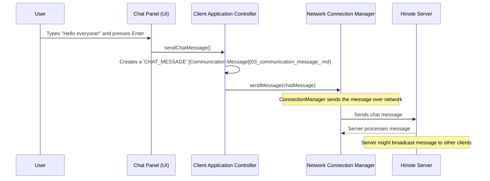

Here's how the `MainController` helps send your chat message:

```java
// File: src/main/java/com/hinote/client/ui/MainController.java
// ... (inside MainController class) ...

@FXML // This means this method is called when an action happens in the UI (e.g., button click)
public void sendChatMessage() {
    String content = chatPanel.getInputText(); // Get text from chat panel

    // Check if there's content and we are connected
    if (content.isEmpty() || !connectionManager.isConnected()) return;

    // Create a Message object (our standard way to talk over network)
    Message message = new Message(
        MessageType.CHAT_MESSAGE, // Type of message
        IdGenerator.generateUniqueId(), // Unique ID for this message
        roomId, userId, username, // Who sent it and where
        JsonUtil.toJsonNode(new com.hinote.shared.protocol.ChatMessageProtocol(content, false)) // Message content
    );

    // Send the message using the network connection manager
    connectionManager.sendMessage(message);
    chatPanel.clearInput(); // Clear your input field
}
```
In this code:
*   `chatPanel.getInputText()`: The controller asks the [Chat Panel](src/main/java/com/hinote/client/ui/components/ChatPanel.java) for the text you typed.
*   `new Message(...)`: The controller creates a standard [Communication Message](03_communication_message_.md) containing your chat text.
*   `connectionManager.sendMessage(message)`: The controller then tells the [Network Connection Manager](04_network_connection_manager_.md) to send this message to the server.

### Scenario 2: Receiving a Chat Message

Now, what if your friend sends *you* a message?

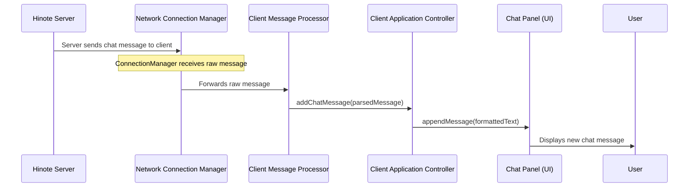

Here's how the `MainController` helps display incoming chat messages:

```java
// File: src/main/java/com/hinote/client/ui/MainController.java
// ... (inside MainController class) ...

public void addChatMessage(ChatMessage message) {
    // Ensure UI update happens on the correct thread for JavaFX
    Platform.runLater(() -> {
        // Format the message for display
        String display = String.format("[%s] %s: %s\n",
            message.getTimestamp().format(DateTimeFormatter.ofPattern("HH:mm:ss")),
            message.getUsername(),
            message.getContent());
        // Tell the chat panel to add the formatted message
        chatPanel.appendMessage(display);
    });
}
```
In this code:
*   The `addChatMessage` method is called by the `MessageHandler` (which we'll cover in [Client Message Processor](05_client_message_processor_.md)) after it receives and understands a message from the server.
*   `Platform.runLater(() -> ...)`: This is important for JavaFX applications. It ensures that any updates to the user interface (like adding text to the chat box) happen safely.
*   `chatPanel.appendMessage(display)`: The controller tells the [Chat Panel](src/main/java/com/hinote/client/ui/components/ChatPanel.java) to add the new message to its display.

## Summary

The **Client Application Controller** is the central "project manager" for the Hinote client application. It's responsible for:
*   Initializing all user interface components.
*   Setting up network connections.
*   Receiving user actions from UI components (like [Tools Panel](src/main/java/com/hinote/client/ui/components/ToolsPanel.java) or [Chat Panel](src/main/java/com/hinote/client/ui/components/ChatPanel.java)) and sending them to the server via the [Network Connection Manager](04_network_connection_manager_.md).
*   Receiving messages from the server (through the [Network Connection Manager](04_network_connection_manager_.md) and a [Client Message Processor](05_client_message_processor_.md)) and updating the UI accordingly (e.g., drawing on the [Drawing Canvas](02_drawing_canvas_.md) or showing chat messages).

It's the glue that holds the entire client experience together!

In the next chapter, we'll dive deeper into one of the main components the controller manages: the [Drawing Canvas](02_drawing_canvas_.md). You'll learn how it allows users to draw and how it reports those actions back to our controller.

[Next Chapter: Drawing Canvas](02_drawing_canvas_.md)

---

# Chapter 2: Drawing Canvas

Welcome back to Hinote! In our last chapter, we met the `[Client Application Controller](01_client_application_controller_.md)`, the "project manager" that coordinates everything happening on your Hinote screen. It's like the conductor of an orchestra, making sure all the different parts play together in harmony.

Now, let's zoom in on one of the most important instruments in that orchestra: the **Drawing Canvas**.

## What is the Drawing Canvas? Imagine a Smart Whiteboard!

When you open Hinote, the big empty area where you draw, scribble, and type is the **Drawing Canvas**. Think of it as a physical whiteboard, but with a super-smart brain that records everything that happens on it.

**The big problem the Drawing Canvas solves:** How do we make a digital space where users can draw and add text, and have those actions not only appear instantly on their screen but also be ready to share with friends and be undone or redone if needed?

Let's use a common example: **drawing a line.**

When you pick up a digital "pen" tool and draw a line on your Hinote screen:
1.  **Your screen** needs to immediately show that line as you draw it.
2.  **The application** needs to remember *exactly* what you drew (where it started, where it ended, what color, how thick).
3.  **The application** needs to tell the `[Client Application Controller](01_client_application_controller_.md)` about your drawing, so it can be sent to other users.
4.  If you make a mistake, you should be able to **undo** that line.

The **Drawing Canvas** is the component that handles all these jobs related to drawing and interacting with the visual content.

## Key Jobs of the Drawing Canvas

The Drawing Canvas in Hinote is a busy place! It has several important responsibilities:

*   **Interactive Surface**: It's where you directly interact using your mouse or touchpad to draw lines, shapes, and add text.
*   **Mouse Movement Catcher**: It constantly watches your mouse movements, clicks, and releases to understand what you're trying to draw.
*   **Shape & Text Renderer**: It's responsible for making the lines, circles, rectangles, and text appear visually on your screen.
*   **Local History Manager**: It keeps a record of all your drawing and text actions. This "memory" allows you to `Undo` a mistake or `Redo` an action you changed your mind about.
*   **Communicator with the Controller**: It acts as the voice for your actions, telling the `[Client Application Controller](01_client_application_controller_.md)` whenever you draw something new, so the controller can then send it to other users.
*   **Listener for Other Users' Actions**: It also listens to the `[Client Application Controller](01_client_application_controller_.md)` to receive drawing actions from other users, and then draws them on *your* screen.

## How the Drawing Canvas Works: Drawing a Line

Let's follow our example: **you drawing a line on the canvas.**

### 1. Setting Up the Canvas

First, the `[Client Application Controller](01_client_application_controller_.md)` (specifically, `MainController`) prepares the Drawing Canvas when the application starts.

```java
// File: src/main/java/com/hinote/client/ui/MainController.java
// ... inside initializeComponents() method ...

    // 2. Initialize drawing canvas
    canvasComponent = new DrawingCanvas(600, 400); // Create a canvas of certain size
    
    // Tell the canvas to report drawing actions back to *this* controller
    canvasComponent.setOnDrawingOperationListener(new DrawingCanvas.DrawingOperationListener() {
        @Override
        public void onDrawingOperation(DrawingOperation operation) {
            sendDrawingOperation(operation); // Controller sends drawing to network
        }
        // ... other drawing events like batch updates or text updates ...
    });
    // Add the drawing canvas to the main window
    drawingCanvas.getChildren().add(canvasComponent);
```

Here, the `MainController` creates a new `DrawingCanvas` and, very importantly, sets up a `DrawingOperationListener`. This listener is like giving the Canvas a specific phone number for the `MainController` to call whenever a new drawing or text action happens.

### 2. User Draws a Line

Now, let's see what happens when you interact with the canvas:

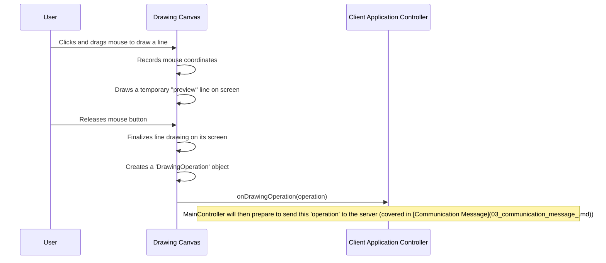

### 3. Inside the Drawing Canvas: Catching Mouse Events

The `DrawingCanvas` uses special code called "event handlers" to listen for mouse actions.

```java
// File: src/main/java/com/hinote/client/ui/components/DrawingCanvas.java
// ... inside setupEventHandlers() method ...

        setOnMousePressed(e -> { // When mouse button is pressed down
            isDrawing = true;
            startX = e.getX(); // Store starting X position
            startY = e.getY(); // Store starting Y position
            // ... logic for different tools like pen, text ...
        });

        setOnMouseDragged(e -> { // When mouse is moved while button is pressed
            if (isDrawing && !"TEXT".equals(currentTool)) {
                // ... code to draw preview shapes (lines, rectangles, circles) ...
                redrawAllOperations(); // Clear and redraw everything
                drawPreview(startX, startY, e.getX(), e.getY()); // Draw a new temporary preview
            }
        });

        setOnMouseReleased(e -> { // When mouse button is released
            if (isDrawing) {
                double endX = e.getX(); // Get final X position
                double endY = e.getY(); // Get final Y position
                // ... logic for different tools ...
                drawAndSendLine(startX, startY, endX, endY); // Draw final line and tell controller
            }
            isDrawing = false; // Reset drawing flag
        });
```
When you press your mouse, the canvas remembers where you started (`startX`, `startY`). As you drag, it clears the canvas and redraws all previous items, then draws a *temporary* line (a "preview") to show you what your line will look like. When you let go, it makes the line permanent.

### 4. Making the Drawing Permanent and Notifying the Controller

Once you release the mouse, the canvas draws the final shape and packages all the information about that drawing into a `DrawingOperation` object.

```java
// File: src/main/java/com/hinote/client/ui/components/DrawingCanvas.java
// ... example for a line ...

    private void drawAndSendLine(double startX, double startY, double endX, double endY) {
        // First, draw the line on the canvas itself
        gc.save(); // Save current drawing settings
        gc.setStroke(Color.web(currentColor)); // Set line color
        gc.setLineWidth(strokeWidth); // Set line thickness
        gc.strokeLine(startX, startY, endX, endY); // Draw the line!
        gc.restore(); // Restore previous drawing settings
        
        if (listener != null) {
            // Create a DrawingOperation object with all details
            DrawingOperation operation = new DrawingOperation(
                "DRAW_LINE", startX, startY, endX, endY, 
                currentColor, strokeWidth, "current-user-id"
            );
            operation.setOperationId("op-" + System.currentTimeMillis()); // Give it a unique ID
            
            addSingleOperation(operation); // Add to history and notify listener
        }
    }

    private void addSingleOperation(DrawingOperation operation) {
        operationHistory.add(new DrawingOperation(operation)); // Add to canvas's memory
        
        // Push to undo stack (so we can undo it later)
        List<DrawingOperation> singleOpGroup = new ArrayList<>();
        singleOpGroup.add(new DrawingOperation(operation));
        undoStack.push(singleOpGroup); 
        redoStack.clear(); // Clear redo stack as a new action was performed

        // Tell the MainController about this new operation!
        if (listener != null) {
            listener.onDrawingOperation(operation); 
        }
        // ... also handle batching and UI updates ...
    }
```
The `drawAndSendLine` method actually makes the line appear on the canvas using `gc.strokeLine(...)`. Then, it creates a `DrawingOperation` object, which is like a digital blueprint of your line. This blueprint contains all the details: `DRAW_LINE`, start/end coordinates, color, and thickness.

Finally, it calls `addSingleOperation` which does two things:
1.  **Records History**: It adds the `DrawingOperation` to `operationHistory` (a list of all drawing actions) and the `undoStack` (for undo/redo).
2.  **Notifies Controller**: It then uses the `listener` (which is our `MainController`) to send this `DrawingOperation` object. This is how the `MainController` knows something was drawn and can prepare to send it to the server.

### 5. Managing History: Undo and Redo

The `DrawingCanvas` doesn't just draw; it remembers! It uses two special lists called `undoStack` and `redoStack`.

| Feature | What it does                                          | How it's used                                                                                                                                                                                                                                                                                             |
| :------ | :---------------------------------------------------- | :---------------------------------------------------------------------------------------------------------------------------------------------------------------------------------------------------------------------------------------------------------------------------------------- |
| `undoStack` | Stores all completed drawing and text operations. | When you draw, the operation is added here. When you `undo`, the last operation is taken from here and moved to `redoStack`. The canvas then redraws itself without that operation.                                                                                                    |
| `redoStack` | Stores operations that were just undone.          | When you `redo`, the last undone operation is taken from here and put back onto `undoStack`. The canvas then redraws itself with that operation. If you draw something new, the `redoStack` is cleared because the "future" has changed. |

Here's a simplified look at the `undo` method:

```java
// File: src/main/java/com/hinote/client/ui/components/DrawingCanvas.java
// ... inside DrawingCanvas class ...

    public List<DrawingOperation> undo() {
        if (!undoStack.isEmpty()) { // Can only undo if there's something to undo
            List<DrawingOperation> operationsToUndo = undoStack.pop(); // Get the last group of operations
            redoStack.push(new ArrayList<>(operationsToUndo)); // Move it to redo stack

            // Remove these operations from the main history
            for (DrawingOperation op : operationsToUndo) {
                operationHistory.removeIf(historyOp -> historyOp.equals(op));
                // Handle removing associated text if it was a text operation
                if ("TEXT_OPERATION".equals(op.getOperationType())) {
                    String textId = extractTextIdFromOperation(op);
                    if (textId != null) textOperations.remove(textId);
                }
            }

            redrawAllOperations(); // Clear canvas and draw everything *except* the undone operations
            // Notify MainController that undo happened
            if (listener != null) listener.onUndo(); 
            return operationsToUndo;
        }
        return Collections.emptyList();
    }
```
When `undo()` is called, the canvas takes the last set of operations from `undoStack`, puts them into `redoStack`, removes them from its `operationHistory` list, and then completely redraws itself based on the updated `operationHistory`. This makes the undone action disappear from the screen!

### 6. Displaying Others' Drawings

The Drawing Canvas also knows how to draw actions that come from other users (via the `[Client Application Controller](01_client_application_controller_.md)`).

```java
// File: src/main/java/com/hinote/client/ui/components/DrawingCanvas.java
// ... inside DrawingCanvas class ...

    public void applyDrawingOperation(DrawingOperation operation) {
        if (operation != null) {
            operationHistory.add(new DrawingOperation(operation)); // Add to history
            applyOperationWithoutHistory(operation); // Draw it immediately
        }
    }

    private void applyOperationWithoutHistory(DrawingOperation operation) {
        gc.save(); // Save current drawing settings
        // ... choose drawing tool, color, width based on operation type ...
        switch (operation.getOperationType()) {
            case "DRAW_LINE":
                gc.strokeLine(operation.getStartX(), operation.getStartY(),
                              operation.getEndX(), operation.getEndY());
                break;
            // ... cases for other shapes like rectangle, circle, erase, clear ...
        }
        gc.restore(); // Restore drawing settings
    }
```
When `applyDrawingOperation` is called (by the `MainController` when it receives an operation from another user), the canvas simply adds the operation to its `operationHistory` and then draws it directly onto the screen. This ensures that everyone sees the same drawing!

## Summary

The **Drawing Canvas** is the heart of visual interaction in Hinote. It's like your personal digital whiteboard that:
*   **Listens** to your mouse actions.
*   **Draws** shapes and text on your screen.
*   **Remembers** every stroke for undo/redo.
*   **Talks** to the `[Client Application Controller](01_client_application_controller_.md)` to share your actions.
*   **Displays** what other users draw.

It's the core component that makes collaborative drawing possible by managing all the local visual aspects and reporting back to the `[Client Application Controller](01_client_application_controller_.md)`.

In the next chapter, we'll look at the "language" that the `[Client Application Controller](01_client_application_controller_.md)` and the Drawing Canvas use to talk to each other, and more importantly, the language Hinote uses to communicate over the network: the **Communication Message**.

[Next Chapter: Communication Message](03_communication_message_.md)

---

# Chapter 3: Communication Message

Welcome back to Hinote! In our previous chapters, we learned about the `[Client Application Controller](01_client_application_controller_.md)` as the "brain" that manages everything on your Hinote screen, and the `[Drawing Canvas](02_drawing_canvas_.md)` as the interactive whiteboard where you draw. You've seen how the canvas reports your drawing actions to the controller, and how the controller helps send your chat messages.

But how do these different parts of Hinote – especially the client and the server – actually *talk* to each other? What "language" do they use?

## The Problem: How Do We Send Any Kind of Information?

Imagine you're trying to send different things to a friend: a birthday card, a shopping list, or a drawing. If you used a completely different way to package and label each item, it would be very confusing for your friend to receive and understand them.

In Hinote, we have many types of information exchanged:
*   You type a **chat message**.
*   You draw a **line**.
*   You **join a room**.
*   Someone else **leaves a room**.
*   The server sends **drawing history**.

If every single one of these actions had its own unique way of being sent over the internet, our code would become incredibly messy and hard to manage. We need a standardized "envelope" that can hold *any* kind of information.

## The Solution: The Hinote `Message`

This is where the **Communication Message** comes in! In Hinote, every piece of information – every action, every update – that travels between the client and the server is wrapped inside a special **`Message`** object.

Think of it like a standardized **postcard** or an **envelope**. No matter what you put inside (a birthday wish, a shopping list, a drawing), the outside of the postcard or envelope always has the same basic information:

*   **Who sent it?** (Your name)
*   **Where is it going?** (Your friend's address)
*   **What type of communication is it?** (A letter, a postcard, a package)
*   And finally, the **actual content** inside.

The Hinote `Message` works in a very similar way. It's our universal "envelope" for all data, making communication clear and consistent.

## What's Inside a Hinote `Message`?

Every `Message` object has a few standard parts, just like our postcard analogy:

| Part of Message      | Postcard Analogy         | What it tells us                                                       |
| :------------------- | :----------------------- | :--------------------------------------------------------------------- |
| `type`               | "Type of Mail"           | What kind of action is this? (e.g., `CHAT_MESSAGE`, `DRAW_OPERATION`, `JOIN_ROOM`). This is super important for the receiver to know how to handle the content. |
| `id`                 | "Tracking Number"        | A unique identifier for *this specific message*. Helpful for tracking. |
| `roomId`             | "Destination Room Number"| Which collaborative room does this message belong to?                   |
| `userId`             | "Sender's ID"            | The unique ID of the user who sent this message.                        |
| `username`           | "Sender's Name"          | The friendly name of the user who sent this message.                   |
| `timestamp`          | "Date Sent"              | When was this message created?                                        |
| `payload`            | "The Actual Content"     | This is the body of the postcard – the actual data (e.g., the chat text, drawing coordinates). Its format depends on the `type`. |

All these parts ensure that when a `Message` arrives, the receiver (either the server or another client) knows exactly who sent it, where it belongs, what it's about, and how to understand its content.

## How to Use It: Sending a Chat Message with a `Message`

Let's revisit our example from Chapter 1: **sending a chat message.** When you type "Hello everyone!" and press Enter, the `[Client Application Controller](01_client_application_controller_.md)` needs to package this text into a `Message` object.

Here's how the controller creates that `Message`:

```java
// File: src/main/java/com/hinote/client/ui/MainController.java
// ... (inside MainController class, simplified method) ...

public void sendChatMessage() {
    String content = chatPanel.getInputText(); // Get text from chat panel

    if (content.isEmpty()) return; // Don't send empty messages

    // 1. Prepare the 'payload' (the actual chat content)
    // This is like writing the message on the postcard.
    com.hinote.shared.protocol.ChatMessageProtocol chatPayload =
        new com.hinote.shared.protocol.ChatMessageProtocol(content, false);

    // 2. Create the standard 'Message' envelope
    // This wraps the payload and adds all the header info.
    Message message = new Message(
        MessageType.CHAT_MESSAGE,          // What kind of message? It's a chat!
        IdGenerator.generateUniqueId(),    // A unique ID for this message
        roomId, userId, username,          // Who sent it and where it belongs
        JsonUtil.toJsonNode(chatPayload)   // The chat content, packaged for the Message
    );

    // 3. Send the message (ConnectionManager handles the actual sending)
    connectionManager.sendMessage(message);
    chatPanel.clearInput(); // Clear your input field
}
```

In this code:
*   We first create a `ChatMessageProtocol` object. This is a small, specific object designed *just* to hold chat content. It's our "birthday wish" written on the postcard.
*   Then, we create the `Message` object itself. We specify its `MessageType` as `CHAT_MESSAGE`, give it unique IDs, and most importantly, put our `chatPayload` inside the `payload` field.
*   Notice `JsonUtil.toJsonNode(chatPayload)`. This is a helper that converts our specific `chatPayload` object into a generic `JsonNode`, which is like putting the written postcard into a transparent container that the `Message` envelope can hold. This `JsonNode` allows the `Message` to carry *any* type of content flexibly.
*   Finally, the `[Network Connection Manager](04_network_connection_manager_.md)` takes this fully prepared `Message` and sends it over the internet.

## How it Works Under the Hood: The `Message` Structure

The `Message` class (`src/main/java/com/hinote/shared/protocol/Message.java`) is the blueprint for our message envelope. Let's look at its core parts.

### The `Message` Class

```java
// File: src/main/java/com/hinote/shared/protocol/Message.java
package com.hinote.shared.protocol;

import com.fasterxml.jackson.annotation.JsonProperty;
import com.fasterxml.jackson.databind.JsonNode; // Important for flexible payload

import java.time.LocalDateTime;

public class Message {
    @JsonProperty("type")
    private MessageType type; // The type of action (e.g., CHAT_MESSAGE)

    @JsonProperty("id")
    private String id; // Unique ID for this message
    
    @JsonProperty("roomId")
    private String roomId; // Which room it's for
    
    @JsonProperty("userId")
    private String userId; // Who sent it
    
    @JsonProperty("username")
    private String username; // Sender's display name
    
    @JsonProperty("timestamp")
    private LocalDateTime timestamp; // When it was sent
    
    @JsonProperty("payload")
    private JsonNode payload; // The actual content (flexible format)

    // Constructor, getters, and setters here...
    // (Simplified for brevity)
    public Message() { this.timestamp = LocalDateTime.now(); } // Sets current time
    public Message(MessageType type, String id, String roomId, String userId, String username, JsonNode payload) {
        this(); // Call default constructor to set timestamp
        this.type = type;
        this.id = id;
        this.roomId = roomId;
        this.userId = userId;
        this.username = username;
        this.payload = payload;
    }
    // ... (other getters and setters) ...
}
```
*   You can see all the "header" information (type, id, roomId, etc.) defined here.
*   The `payload` field is of type `JsonNode`. This is crucial because it allows the `Message` to carry *any* kind of structured data (like `ChatMessageProtocol`, `DrawingOperationProtocol`, etc.) without the `Message` class itself needing to know all the specific details of every possible content type. It's a generic container.

### `MessageType` - What Kind of Action Is It?

The `MessageType` is a special list of predefined values that tells us exactly what kind of action the `Message` represents.

```java
// File: src/main/java/com/hinote/shared/protocol/MessageType.java
package com.hinote.shared.protocol;

public enum MessageType {
    JOIN_ROOM,          // When a user wants to join a room
    LEAVE_ROOM,         // When a user wants to leave
    ROOM_CREATED,       // Server tells clients a room was created
    // ... many other types ...

    CHAT_MESSAGE,       // A regular chat message
    CHAT_HISTORY,       // Server sending past chat messages

    DRAW_OPERATION,     // A single drawing action (like drawing a line)
    BATCH_DRAW_OPERATION, // Multiple drawing actions sent at once
    DRAW_HISTORY,       // Server sending past drawing actions

    UNDO_OPERATION,     // User requests an undo
    REDO_OPERATION,     // User requests a redo

    ERROR,              // Something went wrong
    ACK                 // Acknowledgment (message received!)
}
```
Each of these `MessageType` values corresponds to a specific kind of `payload`. For example, a `CHAT_MESSAGE` type expects a `ChatMessageProtocol` in its `payload`, while a `DRAW_OPERATION` expects a `DrawingOperationProtocol`.

### `JsonUtil` - Packaging and Unpackaging the Payload

Because the `payload` is a generic `JsonNode`, we need a tool to convert our specific objects (like `ChatMessageProtocol`) *into* a `JsonNode` when sending, and *from* a `JsonNode` back into the specific object when receiving. That tool is `JsonUtil`.

```java
// File: src/main/java/com/hinote/shared/utils/JsonUtil.java
package com.hinote.shared.utils;

import com.fasterxml.jackson.databind.JsonNode;
import com.fasterxml.jackson.databind.ObjectMapper;
// ... (other imports) ...

public class JsonUtil {
    private static final ObjectMapper objectMapper = new ObjectMapper();
    // ... (static block, other methods) ...

    public static JsonNode toJsonNode(Object object) {
        // Converts ANY Java object into a generic JsonNode.
        // This is used to put content into the Message's payload.
        try { return objectMapper.valueToTree(object); }
        catch (Exception e) { /* error handling */ return null; }
    }
    
    public static <T> T fromJsonNode(JsonNode node, Class<T> clazz) {
        // Converts a JsonNode back into a specific Java object.
        // This is used to read content from the Message's payload.
        try { return objectMapper.treeToValue(node, clazz); }
        catch (Exception e) { /* error handling */ return null; }
    }
    // ... (other JSON utility methods) ...
}
```
`JsonUtil` acts as our "packer" and "unpacker." When you call `JsonUtil.toJsonNode(chatPayload)`, it takes your `ChatMessageProtocol` object and turns it into a `JsonNode` that can fit into the `Message`'s `payload`. When the server receives the `Message`, it uses `JsonUtil.fromJsonNode()` to convert the `JsonNode` back into a `ChatMessageProtocol` so it can understand the actual chat content.

### Example Payloads: `ChatMessageProtocol` and `DrawingOperationProtocol`

These are just two examples of what goes into the `payload`. Each corresponds to a specific `MessageType`.

**`ChatMessageProtocol` (for `CHAT_MESSAGE` type):**
```java
// File: src/main/java/com/hinote/shared/protocol/ChatMessageProtocol.java
package com.hinote.shared.protocol;

import com.fasterxml.jackson.annotation.JsonProperty;

public class ChatMessageProtocol {
    @JsonProperty("content")
    private String content; // The actual text of the chat message

    @JsonProperty("isSystemMessage")
    private boolean isSystemMessage; // Is this from a user or the system?
    
    // Constructors, getters, and setters...
    // (Simplified for brevity)
    public ChatMessageProtocol(String content, boolean isSystemMessage) {
        this.content = content;
        this.isSystemMessage = isSystemMessage;
    }
    // ...
}
```

**`DrawingOperationProtocol` (for `DRAW_OPERATION` type):**
```java
// File: src/main/java/com/hinote/shared/protocol/DrawingOperationProtocol.java
package com.hinote.shared.protocol;

import com.fasterxml.jackson.annotation.JsonProperty;

public class DrawingOperationProtocol {
    @JsonProperty("operationType")
    private String operationType; // e.g., "DRAW_LINE", "DRAW_RECTANGLE"
    
    @JsonProperty("startX")
    private double startX; // Starting X coordinate
    // ... other coordinates, color, strokeWidth ...
    @JsonProperty("operationId")
    private String operationId; // Unique ID for this specific drawing action
    
    // Constructors, getters, and setters...
    // ...
}
```

## The Full Journey of a Message (Sending a Chat)

Let's visualize the entire process of sending a chat message, focusing on the `Message` itself.

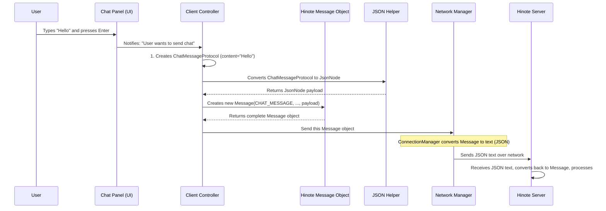

This sequence shows how the `Message` object acts as the central, standardized container that ensures all the necessary information travels together, no matter what the actual content is.

## Summary

The **Communication Message** is the universal "envelope" or "postcard" that Hinote uses for all information exchange between clients and the server.
*   It provides a **standardized format** for every action or update.
*   It includes essential **header information** (sender, room, timestamp, unique ID).
*   It uses a flexible `JsonNode` for its `payload` field, allowing it to carry **any type of content** (chat messages, drawing operations, room join requests).
*   The `MessageType` tells the receiver **how to interpret** the `payload`.
*   `JsonUtil` helps **package and unpackage** the specific content objects into and out of the `JsonNode` payload.

Understanding the `Message` is key to seeing how Hinote achieves real-time collaboration. All actions, from a simple chat to a complex drawing, become a `Message` traveling through the system.

In the next chapter, we'll look at the `[Network Connection Manager](04_network_connection_manager_.md)`, which is the component responsible for actually taking these `Message` objects and sending them across the internet, and also receiving messages from the server.

[Next Chapter: Network Connection Manager](04_network_connection_manager_.md)

---

# Chapter 4: Network Connection Manager

Welcome back to Hinote! In our last chapter, [Communication Message](03_communication_message_.md), we learned about the standardized "envelope" – the `Message` object – that Hinote uses to package all its information, whether it's a chat, a drawing, or a request to join a room. We now know *what* to send.

But how do these `Message` envelopes actually get mailed across the internet to the server? And how do we receive replies back? What happens if your internet connection drops?

## The Problem: Sending & Receiving Data Reliably

Imagine you're trying to send a letter, but you also need to make sure the post office is open, your letter actually gets delivered, and if it doesn't, you try again until it works. It's a lot of work!

In the digital world of Hinote, sending and receiving information over the internet is similar:
1.  **Making the Connection**: We need to open a "digital pipeline" (a WebSocket connection) to the Hinote server.
2.  **Sending Messages**: Once connected, we need to send our `Message` objects through this pipeline.
3.  **Receiving Messages**: We also need to listen for and collect `Message` objects coming back from the server.
4.  **Handling Disconnects**: What if the internet flickers, or the server goes down temporarily? We need a way to automatically try and reconnect so you can keep collaborating without interruption.

Trying to manage all these tasks directly in our main application code would quickly become a headache. It's like the [Client Application Controller](01_client_application_controller_.md) having to be an IT specialist *and* a project manager!

## The Solution: The Network Connection Manager

This is where the **Network Connection Manager** comes in! Think of it as your application's **dedicated IT support person** for the internet connection. Its sole job is to make sure your Hinote application is always connected to the server, and if the connection drops, it tries its best to fix it automatically.

It handles all the tricky parts of network communication, so the [Client Application Controller](01_client_application_controller_.md) can focus on managing the drawing and chat, and not worry about whether the internet is working.

## Key Jobs of the Network Connection Manager

The Network Connection Manager (`ConnectionManager` class) in Hinote has a few vital responsibilities:

*   **Establish Connection**: Open the initial WebSocket connection to the server when the application starts.
*   **Send Messages**: Take our `Message` objects (from [Communication Message](03_communication_message_.md)) and send them over the network.
*   **Receive Messages**: Catch incoming messages from the server and pass them on for processing.
*   **Monitor Connection**: Keep an eye on the connection status.
*   **Automatic Reconnect**: If the connection breaks, automatically try to re-establish it.

## How to Use It: Connecting and Sending Messages

Let's look at how the [Client Application Controller](01_client_application_controller_.md) uses the `ConnectionManager` to handle network communication.

### 1. Connecting to the Server

As we saw in Chapter 1, the `MainController` (`Client Application Controller`) creates the `ConnectionManager` when the application starts.

```java
// File: src/main/java/com/hinote/client/ui/MainController.java
// ... (inside MainController class, initializeNetwork method) ...

private void initializeNetwork() {
    String serverUrl = "ws://localhost:8080"; // The server's address
    // This 'messageHandler' is what will process incoming messages
    MessageHandler messageHandler = new MessageHandler(this); 
    
    // Create the ConnectionManager and tell it:
    // 1. Where the server is
    // 2. Who should handle messages that arrive from the server
    connectionManager = new ConnectionManager(serverUrl, messageHandler.handleMessage());
    
    // Immediately send a message to join a specific room
    sendJoinRoomMessage();
}
```
Here's what happens:
*   `String serverUrl`: This is the address of our Hinote server (like a phone number).
*   `MessageHandler messageHandler`: This is an object (we'll learn more about it in [Client Message Processor](05_client_message_processor_.md)) that knows what to do with messages *received* from the server. The `connectionManager` just needs to know *who* to give the incoming messages to.
*   `new ConnectionManager(...)`: This line creates our network manager. It immediately tries to connect to the server when it's created.

### 2. Sending a Message

Once connected, when the [Client Application Controller](01_client_application_controller_.md) wants to send information (like your chat message from Chapter 3), it simply asks the `ConnectionManager` to do it.

```java
// File: src/main/java/com/hinote/client/ui/MainController.java
// ... (inside MainController class, simplified sendChatMessage method) ...

public void sendChatMessage() {
    // ... (code to create a Message object, as seen in Chapter 3) ...
    Message message = new Message(
        MessageType.CHAT_MESSAGE, // Type of message
        // ... other message details ...
        JsonUtil.toJsonNode(new com.hinote.shared.protocol.ChatMessageProtocol(content, false))
    );

    // Tell the ConnectionManager to send this message
    connectionManager.sendMessage(message);
    chatPanel.clearInput(); // Clear your input field
}
```
The `connectionManager.sendMessage(message)` call is straightforward. The `ConnectionManager` takes care of converting this `Message` object into a format suitable for network transmission and sending it to the server.

### 3. Checking Connection Status

Sometimes, other parts of the application might need to know if the connection is active before trying to send something.

```java
// File: src/main/java/com/hinote/client/ui/MainController.java
// ... (inside MainController class) ...

if (content.isEmpty() || !connectionManager.isConnected()) {
    // If there's no content or we're not connected, don't send the message
    return; 
}
// ... then proceed to create and send the message ...
```
The `connectionManager.isConnected()` method simply tells us `true` if we have an active connection, and `false` otherwise.

## Under the Hood: How it Works

The `ConnectionManager` relies on another, more specialized component called `WebSocketClientImpl`. Think of the `ConnectionManager` as the overall IT manager, and `WebSocketClientImpl` as the actual technician who operates the connection wires.

### The Connection Process: Initial Connect & Reconnect

Let's trace how the connection is established and maintained.

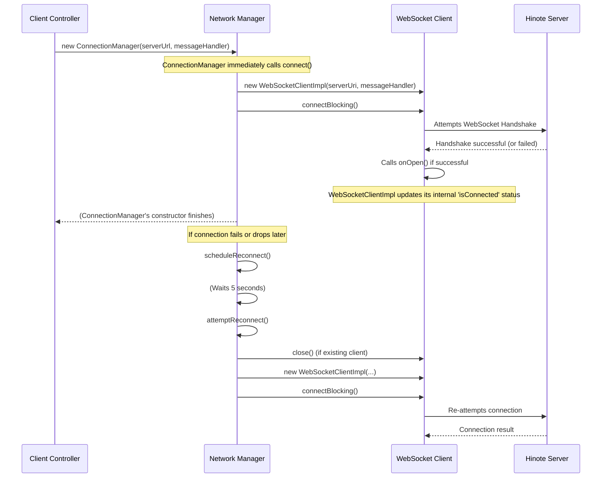

This diagram shows that the `ConnectionManager` creates and manages the `WebSocketClientImpl`. If the connection ever fails (or the initial attempt fails), the `ConnectionManager` automatically starts a timer to `scheduleReconnect` and tries again.

Let's look at the key parts in the code:

```java
// File: src/main/java/com/hinote/client/network/ConnectionManager.java
// ... (simplified for brevity) ...

public class ConnectionManager {
    private final URI serverUri;
    private WebSocketClientImpl client;
    private final Consumer<Message> messageHandler; // Where to send received messages
    private final ScheduledExecutorService executor = Executors.newScheduledThreadPool(1);
    private boolean isReconnecting = false;

    public ConnectionManager(String serverUrl, Consumer<Message> messageHandler) {
        this.serverUri = URI.create(serverUrl);
        this.messageHandler = messageHandler;
        connect(); // Immediately try to connect when created
    }

    public void connect() {
        try {
            client = new WebSocketClientImpl(serverUri, messageHandler);
            client.connectBlocking(); // Tries to connect and waits
            if (!client.isOpen()) {
                scheduleReconnect(); // If failed, try again later
            }
        } catch (Exception e) {
            scheduleReconnect(); // If error, try again later
        }
    }

    private void scheduleReconnect() {
        if (!isReconnecting) {
            isReconnecting = true;
            // Schedule 'attemptReconnect' to run after 5 seconds
            executor.schedule(this::attemptReconnect, 5, TimeUnit.SECONDS);
        }
    }

    private void attemptReconnect() {
        // ... (simplified) ...
        try {
            if (client != null) client.close(); // Close any old connection
            client = new WebSocketClientImpl(serverUri, messageHandler);
            client.connectBlocking(5, TimeUnit.SECONDS); // Try connecting with a timeout
            if (client.isOpen()) {
                isReconnecting = false; // Success!
            } else {
                scheduleReconnect(); // Still failed, try again later
            }
        } catch (Exception e) {
            scheduleReconnect(); // Error during reconnect, try again later
        }
    }
    // ... other methods ...
}
```
*   The `ConnectionManager` takes the `serverUrl` and the `messageHandler` (the function that will process incoming messages).
*   The `connect()` method creates a `WebSocketClientImpl` and tries to connect using `connectBlocking()`. If it fails, it calls `scheduleReconnect()`.
*   `scheduleReconnect()` sets a flag `isReconnecting` and uses a `ScheduledExecutorService` (a built-in Java tool for scheduling tasks) to run `attemptReconnect()` after a delay.
*   `attemptReconnect()` closes any old connection, creates a *new* `WebSocketClientImpl`, and tries connecting again. This cycle repeats until a successful connection is made.

### Sending Messages

When `sendMessage(Message message)` is called on `ConnectionManager`, it simply passes the message to its internal `WebSocketClientImpl`.

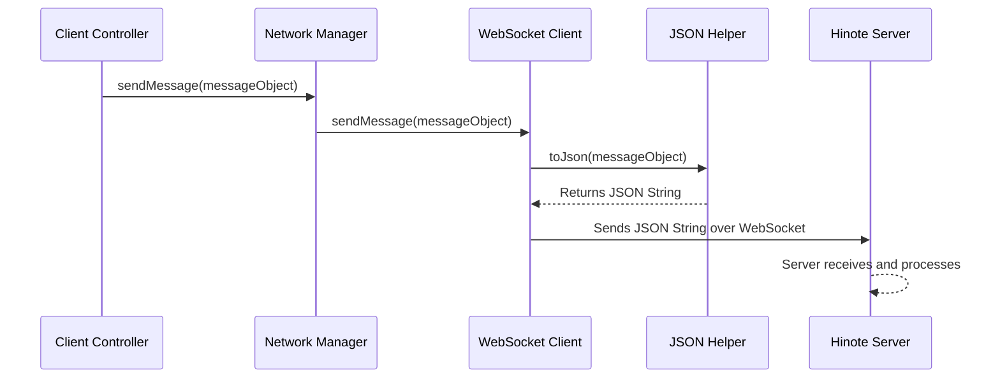

Here's how `WebSocketClientImpl` handles sending:

```java
// File: src/main/java/com/hinote/client/network/WebSocketClientImpl.java
// ... (simplified for brevity) ...

import com.hinote.shared.utils.JsonUtil; // Used to convert Message to JSON string
// ...

public class WebSocketClientImpl extends WebSocketClient {
    // ...
    public void sendMessage(Message message) {
        if (isOpen()) { // Only send if the connection is open
            String json = JsonUtil.toJson(message); // Convert the Message object to a JSON string
            if (json != null) {
                send(json); // Actually send the JSON string over the network
            } else {
                // Handle error if message couldn't be converted
            }
        } else {
            // Warn if trying to send when not connected
        }
    }
    // ...
}
```
*   `JsonUtil.toJson(message)`: Before sending, the `WebSocketClientImpl` uses our `JsonUtil` (from Chapter 3) to convert the `Message` object into a plain text string in JSON format. This is the standard way to send structured data over the internet.
*   `send(json)`: This is the actual command that puts the JSON string onto the network pipeline to be sent to the server.

### Receiving Messages

Receiving messages is the reverse process of sending.

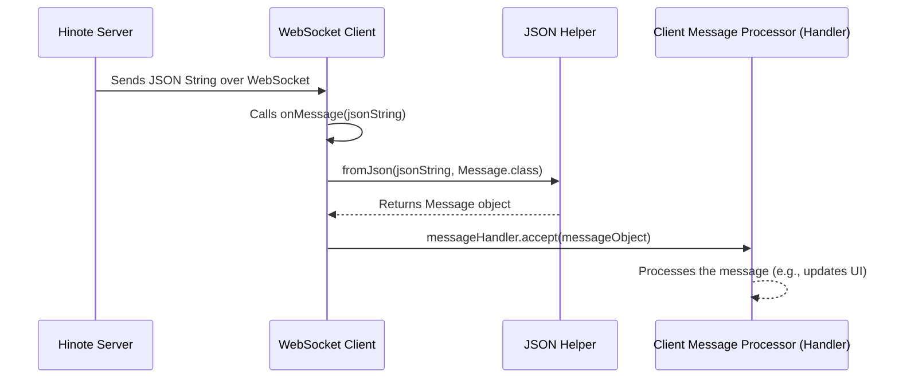

And the code for receiving:

```java
// File: src/main/java/com/hinote/client/network/WebSocketClientImpl.java
// ... (simplified for brevity) ...

import com.hinote.shared.utils.JsonUtil;
// ...
import java.util.function.Consumer; // This is the type for messageHandler

public class WebSocketClientImpl extends WebSocketClient {
    private final Consumer<Message> messageHandler; // The function to call with incoming messages
    // ...

    @Override
    public void onMessage(String message) {
        try {
            // Convert the received JSON string back into a Message object
            Message msg = JsonUtil.fromJson(message, Message.class);
            if (msg != null) {
                // If successful, pass the Message object to our messageHandler
                messageHandler.accept(msg); 
            } else {
                // Log error if parsing failed
            }
        } catch (Exception e) {
            // Log any other errors during processing
        }
    }
    // ...
}
```
*   `onMessage(String message)`: This method is automatically called by the underlying WebSocket library whenever a new message (as a JSON string) arrives from the server.
*   `JsonUtil.fromJson(message, Message.class)`: The `WebSocketClientImpl` uses `JsonUtil` to convert the incoming JSON string back into a structured `Message` object.
*   `messageHandler.accept(msg)`: Once the `Message` object is re-created, it's passed to the `messageHandler` (which we provided from the `MainController` when setting up `ConnectionManager`). This `messageHandler` then decides what to do with the message (e.g., update the [Drawing Canvas](02_drawing_canvas_.md) or display a chat message).

## Summary

The **Network Connection Manager** is the unsung hero that ensures your Hinote client is always talking to the server. It's your application's dedicated "IT support person," responsible for:
*   **Establishing** the initial WebSocket connection.
*   **Monitoring** the connection status.
*   **Automatically reconnecting** if the connection is lost.
*   **Sending** your `Message` objects to the server.
*   **Receiving** `Message` objects from the server and passing them to a handler for processing.

By abstracting away all the complexities of network communication, the `ConnectionManager` allows other parts of Hinote, like the [Client Application Controller](01_client_application_controller_.md), to focus on their main jobs without worrying about the internet connection.

In the next chapter, we'll dive into the **Client Message Processor**. This is the component that receives those `Message` objects from the `Network Connection Manager` and figures out *what* to do with them, updating the right parts of your Hinote application.

[Next Chapter: Client Message Processor](05_client_message_processor_.md)

---

# Chapter 5: Client Message Processor

Welcome back to Hinote! In our last chapter, [Network Connection Manager](04_network_connection_manager_.md), we learned how your Hinote application establishes and maintains its connection to the server, and how it sends and receives raw network data. Think of the `ConnectionManager` as the dedicated postal worker who makes sure mail gets delivered to your digital mailbox.

But once the mail (our [Communication Message](03_communication_message_.md) objects) arrives in your mailbox, what happens next? You don't just leave it there, right? Someone needs to open it, read it, and figure out what to do with it. Is it a chat message? A drawing from a friend? A system update?

## The Problem: What to Do with Incoming Messages?

Imagine your digital mailbox (received by the `ConnectionManager`) gets flooded with all sorts of `Message` objects from the server. Each `Message` could be about:
*   "Your friend Bob just drew a red circle!"
*   "Alice typed: 'Hello everyone!'"
*   "The server wants to tell you the drawing history."
*   "A new user, Charlie, just joined the room."
*   "Oops, an error happened!"

If your main application "brain" – the [Client Application Controller](01_client_application_controller_.md) – had to sort through every single one of these messages itself, it would become overwhelmed and messy very quickly. We need a specialized "clerk" to take each incoming message, understand its type, and route it to the correct part of the application.

## The Solution: The Client Message Processor (`MessageHandler`)

This is exactly the job of the **Client Message Processor**, which in Hinote is primarily handled by the `MessageHandler` class.

Think of the `MessageHandler` as a highly organized **post office sorting clerk**. When a new `Message` arrives from the [Network Connection Manager](04_network_connection_manager_.md), the `MessageHandler`'s job is to:

1.  **Examine the `MessageType`**: Just like a sorting clerk reads "Letter," "Package," or "Bill" on an envelope.
2.  **Interpret the `payload`**: Open the envelope and read the actual content. A "Letter" will have text, a "Package" might have details about what's inside.
3.  **Delegate the Task**: Hand the content to the correct "department" within your Hinote client application to handle it. For a chat message, it goes to the chat department. For a drawing, it goes to the drawing department.

The `MessageHandler` ensures that every incoming message is correctly identified and efficiently passed to the right place, so your [Client Application Controller](01_client_application_controller_.md) (the "project manager") only has to worry about updating the UI or internal state, not the message sorting itself.

## Key Jobs of the Client Message Processor

The `MessageHandler` has these important responsibilities:

*   **Receive Messages**: It is the designated recipient for all `Message` objects delivered by the [Network Connection Manager](04_network_connection_manager_.md).
*   **Identify Message Type**: It checks the `type` field of the `Message` (e.g., `CHAT_MESSAGE`, `DRAW_OPERATION`) to understand its purpose.
*   **Extract Payload**: It carefully extracts the actual content (the `payload`) from the `Message`.
*   **Parse Payload**: It converts the generic `JsonNode` `payload` into a specific object type (like a `ChatMessageProtocol` or `DrawingOperationProtocol`) so it can be easily used.
*   **Delegate to `MainController`**: It calls the appropriate method on the [Client Application Controller](01_client_application_controller_.md) (`MainController`) to perform the actual update (e.g., `addChatMessage`, `applyDrawingOperation`).

## How to Use It: Receiving a Chat Message

Let's trace how the `MessageHandler` processes an incoming chat message.

### 1. Setting Up the Message Handler

As we briefly saw in Chapter 1 and Chapter 4, the `MainController` creates the `MessageHandler` right at the beginning and tells the `ConnectionManager` to use it.

```java
// File: src/main/java/com/hinote/client/ui/MainController.java
// ... inside initializeNetwork() method ...

private void initializeNetwork() {
    String serverUrl = "ws://localhost:8080";
    // 1. Create the MessageHandler, giving it a reference to *this* controller
    MessageHandler messageHandler = new MessageHandler(this); 
    
    // 2. Create the ConnectionManager, telling it where the server is
    //    and *who* should process messages that arrive (our messageHandler)
    connectionManager = new ConnectionManager(serverUrl, messageHandler.handleMessage());
    
    sendJoinRoomMessage(); // Send initial message to server
}
```
Here, `new MessageHandler(this)` creates our message sorting clerk. We pass `this` (which refers to the `MainController` itself) so that the `MessageHandler` knows who to talk to when it needs to delegate tasks later.

The crucial part `messageHandler.handleMessage()` is a special function provided by the `MessageHandler` that the `ConnectionManager` will call whenever a new message arrives from the server.

### 2. A Chat Message Arrives!

Now, let's see what happens when the server sends a chat message to your client application.

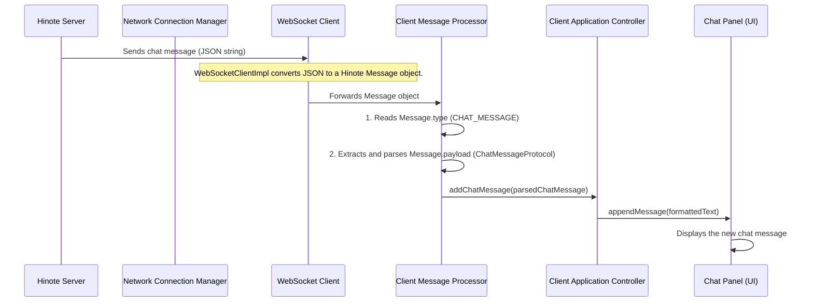

This diagram shows the journey of an incoming message from the server all the way to being displayed on your screen, with the `MessageHandler` playing the key role in the middle.

## Under the Hood: The `MessageHandler` in Action

Let's dive into the `MessageHandler.java` file to see how this sorting process works.

### The Entry Point: `handleMessageInternal`

The `ConnectionManager` calls `messageHandler.handleMessage()` which internally calls `handleMessageInternal`. This is the main "sorting desk" for all incoming messages.

```java
// File: src/main/java/com/hinote/client/network/MessageHandler.java
package com.hinote.client.network;
// ... (imports) ...

public class MessageHandler {
    private final MainController mainController; // Reference to our controller

    public MessageHandler(MainController mainController) {
        this.mainController = mainController;
    }

    public Consumer<Message> handleMessage() {
        return this::handleMessageInternal; // This is the method ConnectionManager calls
    }

    private void handleMessageInternal(Message message) {
        if (message == null) { /* log warning */ return; }
        
        try {
            // This is the "sorting clerk" reading the message type!
            switch (message.getType()) {
                case CHAT_MESSAGE:
                    handleChatMessage(message); // Found a chat message, send it to chat handler
                    break;
                case DRAW_OPERATION:
                    handleDrawingOperation(message); // Found a drawing, send to drawing handler
                    break;
                case BATCH_DRAW_OPERATION:
                    handleBatchDrawOperation(message);
                    break;
                // ... many other message types handled here ...
                case USER_JOINED:
                case USER_LEFT:
                    handleUserStatusChange(message);
                    break;
                case ERROR:
                    handleError(message);
                    break;
                default:
                    // If we don't know this type, log a warning
                    logger.warn("Unhandled message type: {}", message.getType());
            }
        } catch (Exception e) {
            logger.error("Error handling message of type {}: {}", message.getType(), e.getMessage(), e);
        }
    }
    // ... (other handler methods below) ...
}
```
*   `mainController`: This is the reference to our [Client Application Controller](01_client_application_controller_.md) that we passed in the constructor. The `MessageHandler` uses this to call methods on the `MainController`.
*   `return this::handleMessageInternal`: This line essentially says, "Whenever you (the `ConnectionManager`) get a `Message`, call *my* `handleMessageInternal` method with that `Message`."
*   `switch (message.getType())`: This is the core of the `MessageHandler`'s job. It looks at the `MessageType` (from [Communication Message](03_communication_message_.md)) of the incoming `message` and directs it to the appropriate helper method.

### Handling a Chat Message

Let's see what happens when `handleChatMessage(message)` is called:

```java
// File: src/main/java/com/hinote/client/network/MessageHandler.java
// ... (inside MessageHandler class) ...

    private void handleChatMessage(Message message) {
        System.out.println("📩 CHAT_MESSAGE received: " + message.getPayload().toPrettyString());
        // 1. Convert the generic JsonNode payload into a specific ChatMessageProtocol object
        ChatMessageProtocol chatMsgProtocol = JsonUtil.fromJsonNode(
            message.getPayload(), 
            ChatMessageProtocol.class
        );
        
        if (chatMsgProtocol != null && mainController != null) {
            // 2. Create a client-side ChatMessage model from the protocol data
            ChatMessage clientChatMessage = new ChatMessage(
                message.getUsername(),
                chatMsgProtocol.getContent(),
                chatMsgProtocol.isSystemMessage(),
                message.getTimestamp()
            );
            // 3. Delegate to the MainController to actually display the message
            mainController.addChatMessage(clientChatMessage);
        }
    }
```
In this method:
1.  `JsonUtil.fromJsonNode(...)`: We use `JsonUtil` (from [Communication Message](03_communication_message_.md)) to convert the generic `JsonNode` (which holds the raw chat data) into a `ChatMessageProtocol` object. This makes it easy to access the `content` and `isSystemMessage` fields.
2.  `new ChatMessage(...)`: We then create a `ChatMessage` object, which is a simpler, client-specific representation of a chat message, using data from the `Message` and the `chatMsgProtocol`.
3.  `mainController.addChatMessage(...)`: Finally, the `MessageHandler` delegates the task to the `MainController`. It tells the `MainController` to "add this chat message to the chat display," without `MessageHandler` needing to know *how* that happens.

### Handling a Drawing Operation

Similarly, for a drawing operation:

```java
// File: src/main/java/com/hinote/client/network/MessageHandler.java
// ... (inside MessageHandler class) ...

    private void handleDrawingOperation(Message message) {
        // We only process drawing operations from *other* users, not ourselves
        if (!message.getUserId().equals(mainController.getUserId())) {
            // 1. Convert generic payload to specific DrawingOperationProtocol
            DrawingOperationProtocol protocol = JsonUtil.fromJsonNode(
                message.getPayload(), 
                DrawingOperationProtocol.class
            );

            // 2. Create a client-side DrawingOperation object
            DrawingOperation operation = new DrawingOperation();
            operation.setOperationType(protocol.getOperationType());
            operation.setStartX(protocol.getStartX());
            operation.setStartY(protocol.getStartY());
            // ... set other properties like endX, endY, color, strokeWidth ...
            operation.setUserId(message.getUserId());
            operation.setOperationId(protocol.getOperationId());

            // 3. Delegate to MainController to apply the drawing
            mainController.applyDrawingOperation(operation);
        }
    }
```
*   `if (!message.getUserId().equals(mainController.getUserId()))`: This important check ensures we only apply drawing operations that came from *other* users. We don't need to redraw our own drawings when they come back from the server; we already drew them locally on the [Drawing Canvas](02_drawing_canvas_.md).
*   `JsonUtil.fromJsonNode(...)`: Again, we parse the `payload` into a `DrawingOperationProtocol`.
*   `new DrawingOperation(...)`: We then create a client-side `DrawingOperation` object.
*   `mainController.applyDrawingOperation(...)`: The `MessageHandler` tells the `MainController` to apply this drawing, which the `MainController` will then pass to the [Drawing Canvas](02_drawing_canvas_.md).

## Summary

The **Client Message Processor** (`MessageHandler`) is like the expert sorting clerk for your Hinote client application. It sits between the [Network Connection Manager](04_network_connection_manager_.md) (the post worker) and the [Client Application Controller](01_client_application_controller_.md) (the project manager). Its main responsibilities are:

*   Receiving all `Message` objects that arrive from the server.
*   Reading the `MessageType` to understand what kind of information is inside.
*   Extracting and correctly interpreting the `payload` (the actual content) of the message.
*   Delegating the task of updating the UI or internal state to the appropriate methods in the [Client Application Controller](01_client_application_controller_.md).

By doing this, the `MessageHandler` makes sure that every piece of information from the server is handled correctly and efficiently, keeping your collaborative Hinote experience smooth and responsive!

In the next chapter, we'll shift our focus from the client to the server side and explore the **Server Connection Gateway**, which is the server's equivalent of the [Network Connection Manager](04_network_connection_manager_.md).

[Next Chapter: Server Connection Gateway](06_server_connection_gateway_.md)

---

# Chapter 6: Server Connection Gateway

Welcome to the server side of Hinote! In our last chapter, [Client Message Processor](05_client_message_processor_.md), we saw how your Hinote client application skillfully sorts and handles all the messages it receives from the server. It's like a post office clerk making sure your client's mailbox never gets messy.

Now, let's flip to the other side of the conversation: the Hinote server. If your client needs a "post office clerk" to receive messages, the server needs an even bigger operation. It's not just receiving messages from one client, but from *all* connected clients simultaneously!

## The Problem: How Does the Server Manage All Clients and Messages?

Imagine the Hinote server as a bustling, multi-story office building. Many clients (users) want to enter this building to collaborate. Each client might:
*   Try to **connect** to the server for the first time.
*   **Send a chat message** to a specific room.
*   **Draw a line** on a shared canvas.
*   **Disconnect** and leave the building.

If there wasn't a central, organized system for handling these interactions, the server would quickly become chaotic. Who is connected? Which message belongs to which room? How do we send a message back to *just one* client, or to *everyone* in a specific room? Without a dedicated system, the server would be overwhelmed, leading to slow performance and lost messages.

## The Solution: The Server Connection Gateway (`WebSocketHandler`)

This is where the **Server Connection Gateway** comes in! In Hinote, this role is primarily fulfilled by the `WebSocketHandler` class.

Think of the `WebSocketHandler` as the **main entrance, security desk, and reception area** for the entire Hinote server. Its job is to:

1.  **Welcome Clients:** Greet every incoming client connection.
2.  **Manage Visitors:** Keep track of who is currently connected to the server.
3.  **Receive All Mail:** Accept all messages sent from clients.
4.  **Direct Mail:** Hand over received messages to the appropriate "department" (the `[MessageRouter](src/main/java/com/hinote/server/handlers/MessageRouter.java)`) for further processing.
5.  **Send Out Mail:** Provide ways to send messages back to individual clients or broadcast messages to all clients in a specific room.

It's the server's central point of contact, ensuring that all client interactions are managed smoothly and efficiently.

## Key Jobs of the Server Connection Gateway

The `WebSocketHandler` is a very busy component on the server. Here are its main responsibilities:

| Job                      | What it does                                                                  | Analogy                                   |
| :----------------------- | :---------------------------------------------------------------------------- | :---------------------------------------- |
| **Listens for Connections** | Waits for new clients to connect to the server.                               | Keeping the main entrance doors open.     |
| **Manages Clients**      | Keeps a list of all currently connected clients.                              | Maintaining a visitor logbook.            |
| **Receives Raw Messages**| Gets the raw text messages (JSON strings) from clients.                       | Collecting all incoming letters.          |
| **Delegates Processing** | Passes the received messages to the `[MessageRouter](src/main/java/com/hinote/server/handlers/MessageRouter.java)` for actual understanding and action. | Handing letters to the sorting department.|
| **Sends Messages**       | Can send a message directly to one specific client.                           | Sending a private memo to a visitor.      |
| **Broadcasts Messages**  | Can send a message to all clients within a particular collaborative room.       | Making an announcement to everyone in a meeting room. |

## How to Use It: Starting the Server and Handling a Connection

Let's look at how the `HinoteServer` application uses the `WebSocketHandler` to get everything running.

### 1. Starting the Hinote Server

The `HinoteServer` is the very starting point for our server application. Its `main` method sets up all the necessary components, including our `WebSocketHandler`, and then starts it.

```java
// File: src/main/java/com/hinote/server/HinoteServer.java
package com.hinote.server;

import com.hinote.server.handlers.WebSocketHandler;
// ... (other imports) ...

public class HinoteServer {
    public static void main(String[] args) {
        try {
            // ... (setup RoomService, SynchronizationService) ...
            
            // Create WebSocketHandler (the Server Connection Gateway)
            WebSocketHandler webSocketHandler = new WebSocketHandler(
                new InetSocketAddress("localhost", 8080), // Address and port to listen on
                roomService,
                syncService
            );
            
            // Start the server - opens the "entrance"
            webSocketHandler.start();
            System.out.println("Hinote server started on ws://localhost:8080");
            
            // ... (shutdown hook and keeping server running) ...
            
        } catch (Exception e) {
            System.err.println("Failed to start server: " + e.getMessage());
            e.printStackTrace();
        }
    }
}
```
*   `new InetSocketAddress("localhost", 8080)`: This tells the `WebSocketHandler` to listen for connections on your local machine (`localhost`) at port `8080`. This is the server's "address."
*   `webSocketHandler.start()`: This is the crucial line that makes the server "go live." It opens the server's main entrance and starts listening for incoming client connections.

## Under the Hood: How the Gateway Works

Let's trace how the `WebSocketHandler` processes a new client connecting and sending a message.

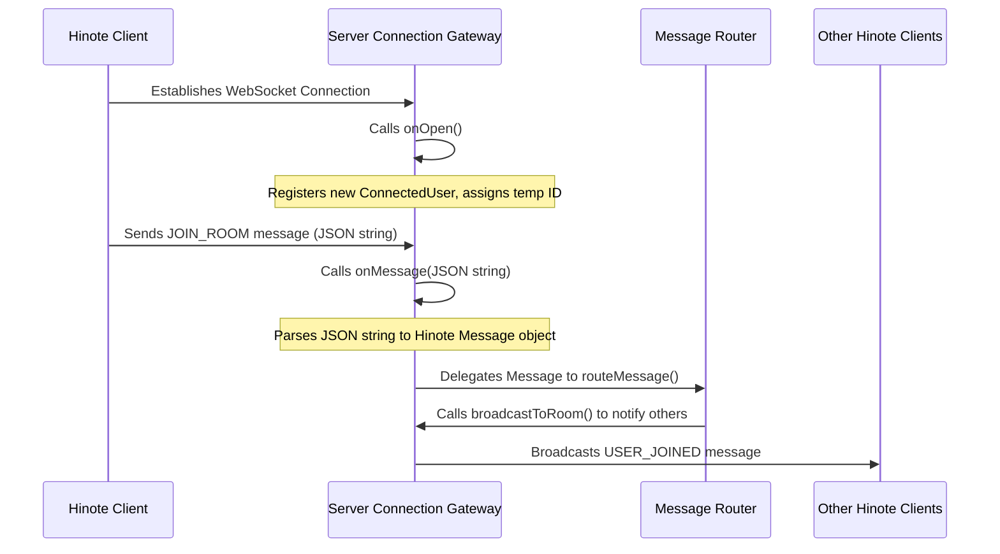

This diagram illustrates the `WebSocketHandler`'s role as the central hub: welcoming the client, receiving its message, and then (through delegation to the `MessageRouter`) broadcasting information to other clients.

### 1. Welcoming New Clients (`onOpen`)

When a new Hinote client successfully connects to the server, the `WebSocketHandler`'s `onOpen` method is automatically triggered. This is like a receptionist greeting a new visitor.

```java
// File: src/main/java/com/hinote/server/handlers/WebSocketHandler.java
// ... (inside WebSocketHandler class) ...

    @Override
    public void onOpen(WebSocket conn, ClientHandshake handshake) {
        logger.info("New connection opened: {}", conn.getRemoteSocketAddress());
        // Create a temporary user until they join a room
        // Assigns a unique ID and a placeholder username
        ConnectedUser user = new ConnectedUser(IdGenerator.generateUserId(), "Anonymous", conn);
        connections.put(conn, user); // Add to our list of connected clients
    }
```
*   `conn`: This object represents the actual WebSocket connection to the specific client. The `WebSocketHandler` uses this to talk directly to that client.
*   `connections.put(conn, user)`: The `WebSocketHandler` maintains a `ConcurrentHashMap` called `connections`. This map stores all active `WebSocket` connections and associates them with a `ConnectedUser` object (which holds their ID, username, etc.). This is how the server "manages" its connected clients.

### 2. Receiving Client Messages (`onMessage`)

Once connected, clients will start sending `[Communication Message](03_communication_message_.md)` objects (packaged as JSON strings) to the server. The `WebSocketHandler`'s `onMessage` method is automatically called whenever a message arrives. This is like the reception desk receiving incoming mail.

```java
// File: src/main/java/com/hinote/server/handlers/WebSocketHandler.java
// ... (inside WebSocketHandler class) ...

    @Override
    public void onMessage(WebSocket conn, String message) {
        logger.debug("Received message: {}", message);
        try {
            // Convert the raw JSON string into a Hinote Message object
            Message msg = JsonUtil.fromJson(message, Message.class);
            if (msg != null) {
                // Delegate the parsed message to the MessageRouter for actual processing
                messageRouter.routeMessage(msg, conn);
            } else {
                logger.error("Failed to parse message: {}", message);
            }
        } catch (Exception e) {
            logger.error("Error processing message: {}", e.getMessage(), e);
        }
    }
```
*   `String message`: This is the raw JSON string received from the client.
*   `JsonUtil.fromJson(message, Message.class)`: Just like on the client side, the server uses `JsonUtil` to convert the raw JSON text back into a structured `[Communication Message](03_communication_message_.md)` object.
*   `messageRouter.routeMessage(msg, conn)`: This is the crucial delegation step. The `WebSocketHandler` doesn't try to understand *what* the message means (e.g., "is it a chat or a drawing?"). Instead, it hands the fully parsed `Message` object and the client's connection (`conn`) to the `[MessageRouter](src/main/java/com/hinote/server/handlers/MessageRouter.java)`. The `MessageRouter` is the next "department" that specializes in figuring out the message's purpose and deciding what actions to take.

### 3. Sending Messages Back: Private and Broadcast

The `WebSocketHandler` also provides the methods for the server to send messages back to clients.

#### Sending a Private Message (`sendToClient`)

If the server needs to respond to a specific client (e.g., confirm they joined a room), it uses `sendToClient`.

```java
// File: src/main/java/com/hinote/server/handlers/WebSocketHandler.java
// ... (inside WebSocketHandler class) ...

    public void sendToClient(WebSocket conn, Message message) {
        if (conn != null && conn.isOpen()) { // Only send if connection is active
            String jsonMessage = JsonUtil.toJson(message); // Convert Message to JSON
            if (jsonMessage != null) {
                conn.send(jsonMessage); // Send the JSON string
                logger.debug("Sent message to client: {}", message.getType());
            } else {
                logger.error("Failed to serialize message: {}", message);
            }
        }
    }
```
*   `conn.send(jsonMessage)`: This line uses the specific `WebSocket` connection (`conn`) to send the message directly to that one client. Before sending, the `Message` object is converted back into a JSON string using `JsonUtil.toJson()`.

#### Broadcasting to a Room (`broadcastToRoom`)

For collaborative actions like chat or drawing, the server needs to send the message to *all* clients in a specific room.

```java
// File: src/main/java/com/hinote/server/handlers/WebSocketHandler.java
// ... (inside WebSocketHandler class) ...

    public void broadcastToRoom(String roomId, Message message) {
        // Get all users associated with this roomId from RoomService
        roomService.getUsersInRoom(roomId).forEach(user -> {
            WebSocket conn = user.getConnection();
            if (conn != null && conn.isOpen()) {
                sendToClient(conn, message); // Send to each user in the room
            }
        });
    }
```
*   `roomService.getUsersInRoom(roomId)`: The `WebSocketHandler` asks the `RoomService` (a component that keeps track of which users are in which rooms) for all `ConnectedUser` objects in the specified `roomId`.
*   `.forEach(user -> { ... sendToClient(conn, message); ... })`: It then loops through each user in that room and uses the `sendToClient` method (which we just looked at) to send the `Message` to each one individually. This effectively "broadcasts" the message.

### 4. Handling Disconnections (`onClose`)

When a client gracefully closes their Hinote application or their internet connection drops, the `WebSocketHandler`'s `onClose` method is called. This is like a visitor leaving the building.

```java
// File: src/main/java/com/hinote/server/handlers/WebSocketHandler.java
// ... (inside WebSocketHandler class) ...

    @Override
    public void onClose(WebSocket conn, int code, String reason, boolean remote) {
        logger.info("Connection closed: {} - Code: {}, Reason: {}", conn.getRemoteSocketAddress(), code, reason);
        // Remove the disconnected user from our list of active connections
        ConnectedUser user = connections.remove(conn);
        if (user != null) {
            // Tell the MessageRouter that this user disconnected
            messageRouter.handleUserDisconnect(user.getUserId(), conn);
        }
    }
```
*   `connections.remove(conn)`: The `WebSocketHandler` removes the `WebSocket` connection and its associated `ConnectedUser` from its `connections` map, cleaning up its internal records.
*   `messageRouter.handleUserDisconnect(...)`: It then informs the `[MessageRouter](src/main/java/com/hinote/server/handlers/MessageRouter.java)` about the disconnection, allowing the `MessageRouter` to update room statuses and potentially broadcast a "user left" message to the room.

## Summary

The **Server Connection Gateway** (`WebSocketHandler`) is the indispensable front-facing component of the Hinote server. It acts as the server's main "reception desk," responsible for:
*   Listening for and **accepting new client connections**.
*   **Managing** the list of all currently connected users.
*   **Receiving** all raw messages from clients and converting them into structured `[Communication Message](03_communication_message_.md)` objects.
*   **Delegating** these parsed messages to the `[MessageRouter](src/main/java/com/hinote/server/handlers/MessageRouter.java)` for specialized handling.
*   Providing the core mechanisms to **send private messages** to individual clients and **broadcast messages** to entire collaborative rooms.
*   **Cleaning up** when clients disconnect.

Without this gateway, the Hinote server wouldn't be able to communicate effectively with clients or manage the collaborative experience.

In our next chapter, we'll dive deeper into how Hinote keeps track of everything happening in a collaborative session by exploring the **Collaborative Room State**.

[Next Chapter: Collaborative Room State](07_collaborative_room_state_.md)

---

# Chapter 7: Collaborative Room State

Welcome back to the server side of Hinote! In our last chapter, [Server Connection Gateway](06_server_connection_gateway_.md), we explored how the Hinote server acts as a welcoming reception desk, managing all incoming client connections and messages. It's great at handling the flow of information.

But after the server receives a message – let's say a drawing operation or a chat message – what happens to that information? Does it just get sent to other currently connected users and then disappear? What if a new user joins the room *after* some drawings have been made or chats have occurred? How would they see the past activity?

## The Problem: Remembering Everything in a Shared Space

Imagine you and your friends are drawing together on a giant digital whiteboard. As you draw, everyone sees it instantly. But what if a new friend arrives? If the server just forwards messages and forgets them, the new friend would see a blank board, missing all the drawings and chat messages that happened before they joined. The "collaborative" part would break down.

To truly enable collaboration, the server needs a way to:
1.  **Store a complete record** of everything that happens in each shared drawing space.
2.  **Know who is in each space** (room) at any given moment.
3.  **Provide this history** to new participants so they can "catch up" and see the complete picture.

Without this central memory, each room would be like a fleeting conversation, with no record for newcomers or for when you need to review past actions.

## The Solution: The Collaborative Room State (`ServerRoom`)

This is where the **Collaborative Room State** comes in! On the Hinote server, the `ServerRoom` class is exactly this central memory. Think of a `ServerRoom` as a **shared digital notebook** for a specific collaborative drawing space. Everything that happens in that room – every drawing, every chat message, every user joining or leaving – is carefully recorded and kept organized within its `ServerRoom` instance.

Each `ServerRoom` is like a unique, persistent container on the server that holds all the essential information needed to describe that single collaborative session.

## Key Concepts of a `ServerRoom`

A `ServerRoom` object is packed with important information. Let's look at its main components:

| Component         | What it tells us                                                       | Analogy                                   |
| :---------------- | :--------------------------------------------------------------------- | :---------------------------------------- |
| **`roomId`**      | A unique ID for *this specific room*.                                  | The unique serial number of the notebook. |
| **`roomName`**    | A friendly name for the room (e.g., "Team Brainstorm").                | The title on the notebook's cover.        |
| **`users`**       | A list of all `[ConnectedUser](src/main/java/com/hinote/server/models/ConnectedUser.java)`s currently active in this room. | The attendance list of who's currently writing in the notebook. |
| **`chatHistory`** | A list of all `[Communication Message](03_communication_message_.md)`s that were chat messages sent in this room. | All the chat messages written in the notebook. |
| **`drawingHistory`** | A list of all `[Communication Message](03_communication_message_.md)`s that were drawing operations in this room. | All the drawings sketched in the notebook. |
| **`textHistory`** | A list of all `[Communication Message](03_communication_message_.md)`s that were text operations (like adding a sticky note) in this room. | All the text notes written in the notebook. |

By keeping all this information together, the `ServerRoom` becomes the definitive source of truth for its collaborative space.

## How it Works: A New User Joins a Room

Let's trace our use case: **a new Hinote client connects to the server and wants to join a specific room.**

When a client sends a `JOIN_ROOM` message, here's how the `ServerRoom` ensures they get the full history:

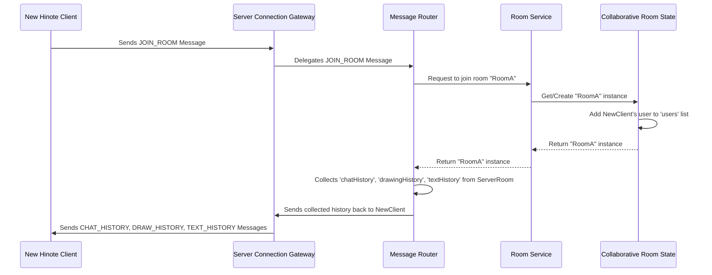

This sequence shows that the `ServerRoom` is the key place where the server looks to find out who is in the room and what has happened in that room.

## Under the Hood: The `ServerRoom` Class

Let's look at the `ServerRoom` class (`src/main/java/com/hinote/server/models/ServerRoom.java`) to see how it stores and manages this shared state.

### 1. Creating a `ServerRoom`

When the first user attempts to join a room, if that room doesn't exist yet, a new `ServerRoom` object is created.

```java
// File: src/main/java/com/hinote/server/models/ServerRoom.java
package com.hinote.server.models;

import com.hinote.shared.protocol.Message;
import java.util.List;
import java.util.Set;
import java.util.concurrent.ConcurrentHashMap; // For thread-safe users
import java.util.concurrent.CopyOnWriteArrayList; // For thread-safe history lists

public class ServerRoom {
    private final String roomId;
    private final String roomName;
    private final Set<ConnectedUser> users = ConcurrentHashMap.newKeySet(); // Who's in the room
    private final List<Message> chatHistory = new CopyOnWriteArrayList<>(); // All chat messages
    private final List<Message> drawingHistory = new CopyOnWriteArrayList<>(); // All drawing ops
    private final List<Message> textHistory = new CopyOnWriteArrayList<>(); // All text ops

    public ServerRoom(String roomId, String roomName) {
        this.roomId = roomId;
        this.roomName = roomName;
    }
    // ... (rest of the class) ...
}
```
*   `roomId` and `roomName`: These are set when the room is created, giving it its identity.
*   `users`: This uses `ConcurrentHashMap.newKeySet()`, which is a special type of `Set` that can be safely accessed and modified by many different parts of the server at the same time (important for a multi-user application!). It holds `[ConnectedUser](src/main/java/com/hinote/server/models/ConnectedUser.java)` objects for everyone currently in the room.
*   `chatHistory`, `drawingHistory`, `textHistory`: These lists use `CopyOnWriteArrayList`, another special type of `List` that allows multiple parts of the server to read from it while another part is adding new items, all without causing errors. Crucially, these lists store `[Communication Message](03_communication_message_.md)` objects directly. This means the server stores the exact "envelope" that was sent by clients, including all its header information and payload!

### 2. Adding a User

When a user successfully joins a `ServerRoom`, they are added to its `users` set.

```java
// File: src/main/java/com/hinote/server/models/ServerRoom.java
// ... (inside ServerRoom class) ...

    public void addUser(ConnectedUser user) {
        users.add(user);
    }

    public void removeUser(String userId) {
        users.removeIf(user -> user.getUserId().equals(userId));
    }

    public int getUserCount() {
        return users.size();
    }
    // ... (rest of the class) ...
```
*   `addUser(ConnectedUser user)`: This simple method adds a `[ConnectedUser](src/main/java/com/hinote/server/models/ConnectedUser.java)` object (representing the newly joined client) to the room's list of active participants.
*   `removeUser(String userId)`: When a user leaves, they are removed from this list.
*   `getUserCount()`: Helps the server know how many people are currently in the room.

### 3. Storing History

Any time a client sends a chat message, draws something, or adds text, the server (specifically, the `[MessageRouter](src/main/java/com/hinote/server/handlers/MessageRouter.java)`) will add the incoming `[Communication Message](03_communication_message_.md)` to the appropriate history list in the `ServerRoom`.

```java
// File: src/main/java/com/hinote/server/models/ServerRoom.java
// ... (inside ServerRoom class) ...

    public void addChatMessage(Message message) {
        chatHistory.add(message);
    }

    public void addDrawingOperation(Message message) {
        drawingHistory.add(message);
    }

    public void addTextOperation(Message message) {
        textHistory.add(message);
    }
    // ... (rest of the class) ...
```
*   These methods simply append the received `[Communication Message](03_communication_message_.md)` objects to their respective lists. The server doesn't need to parse the `payload` again here; it just stores the complete `Message` as is. This is efficient because the `Message` already contains all the necessary information.

### 4. Retrieving History

When a new user joins, or if a client needs to re-sync, the server can easily provide the entire history of operations from the `ServerRoom`.

```java
// File: src/main/java/com/hinote/server/models/ServerRoom.java
// ... (inside ServerRoom class) ...

    public List<Message> getChatHistory() {
        return chatHistory;
    }

    public List<Message> getDrawingHistory() {
        return drawingHistory;
    }

    public List<Message> getTextHistory() {
        return textHistory;
    }
    // ... (rest of the class) ...
```
*   These getter methods allow the server to retrieve all the stored `[Communication Message](03_communication_message_.md)` objects. The `[MessageRouter](src/main/java/com/hinote/server/handlers/MessageRouter.java)` can then package these historical messages (or special "history" messages containing these) and send them to the new client.

This way, the new client receives all the past chats and drawings, ensuring they see the same collaborative content as everyone else in the room.

## Summary

The **Collaborative Room State** (represented by the `ServerRoom` class) is a foundational concept for Hinote's server. It acts as the "shared digital notebook" for each collaborative space, ensuring that:
*   A **complete and persistent record** of all activities (chats, drawings, text) within a room is maintained.
*   The server knows **who is currently participating** in a specific room.
*   **New users can easily "catch up"** by receiving the full history of the room's activities upon joining.

By centralizing all this critical information within `ServerRoom` objects, Hinote can provide a consistent and truly collaborative experience to all its users.

In the next chapter, we'll explore the **Server State Synchronizer**. This is the component that takes the historical data and new updates from the `ServerRoom` and efficiently sends them to clients, making sure everyone's view of the collaborative space is up-to-date.

[Next Chapter: Server State Synchronizer](08_server_state_synchronizer_.md)

---

# Chapter 8: Server State Synchronizer

Welcome back to Hinote! In our last chapter, [Collaborative Room State](07_collaborative_room_state_.md), we learned about the `ServerRoom`. We saw how each `ServerRoom` acts like a dedicated "shared digital notebook," meticulously storing every chat message, drawing, and text operation. This is great for keeping a record.

But just having a record isn't enough for a real-time collaborative application. How does Hinote ensure that:
*   When a **new chat message** is sent, everyone in the room sees it instantly?
*   When someone **draws a line**, it appears on *everyone's* screen?
*   When a user **joins a room**, they immediately see all the drawings and chats that happened *before* they arrived?
*   If someone **undos** an action, everyone's screen updates to reflect that change?

## The Problem: Keeping Everyone's Screen Identical and Up-to-Date

Imagine our `ServerRoom` as a perfect, complete archive of everything. Now, how do we make sure that *every single client* (your application, your friend's application, etc.) has an identical, up-to-the-second copy of that archive displayed on their screen? It's like having many people reading the same digital notebook, and every time someone adds a note or erases something, everyone else's copy magically updates.

This is a challenge because:
1.  New actions are constantly happening.
2.  Users join and leave at any time, requiring a "catch-up" mechanism.
3.  Actions like undo/redo don't just add new things, they *change* past history.

If we don't have a reliable way to get changes from the `ServerRoom` to all clients, everyone would quickly see different things, and collaboration would be impossible.

## The Solution: The Server State Synchronizer (`SynchronizationService`)

This is where the **Server State Synchronizer** comes in! In Hinote, this crucial role is filled by the `SynchronizationService` class.

Think of the `SynchronizationService` as the **chief librarian and archivist** for each collaborative room. It works closely with the `ServerRoom` to make sure everyone has the latest copy of the shared content.

Its main responsibilities are:

| Job                      | What it does                                                                  | Analogy                                   |
| :----------------------- | :---------------------------------------------------------------------------- | :---------------------------------------- |
| **Store New Content**    | When new chat/drawing/text messages arrive, it adds them to the `ServerRoom`'s history. | Places newly arrived books on the correct shelf. |
| **Provide Full History** | When a new user joins, it retrieves the *entire* accumulated history from the `ServerRoom` and sends it to that specific user. | Gives a new visitor a copy of *all* the books already on the shelves. |
| **Handle Undoes/Redoes** | Modifies the `ServerRoom`'s history to reflect undo or redo actions.         | Removes books that were "undone" or adds back "redone" ones. |
| **Prepare for Broadcast**| (Works with other services) Ensures updates are ready to be sent to all users in a room. | Prepares a list of changes for announcement to everyone. |

The `SynchronizationService` is the keeper of consistency, ensuring that the `ServerRoom`'s "truth" is correctly reflected on every client's screen.

## How it Works: A New User Joins and Gets the History

Let's use our central use case: **a new Hinote client joins a room and needs to see everything that has happened previously.**

When a client sends a `JOIN_ROOM` message, the `[MessageRouter](src/main/java/com/hinote/server/handlers/MessageRouter.java)` on the server recognizes this request. A key part of `MessageRouter`'s job is to then ask the `SynchronizationService` to send the room's history to the newly joined client.

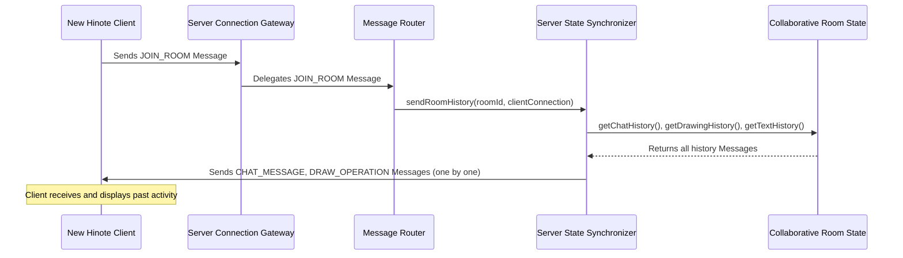

The `SynchronizationService` fetches the history from the `ServerRoom` and then efficiently sends each historical `[Communication Message](03_communication_message_.md)` to the new client.

### Calling `sendRoomHistory`

Here's how another server component, like the `[MessageRouter](src/main/java/com/hinote/server/handlers/MessageRouter.java)`, would tell the `SynchronizationService` to send history to a client:

```java
// Simplified example of how MessageRouter might call SynchronizationService
// File: src/main/java/com/hinote/server/handlers/MessageRouter.java
// (Not the actual MessageRouter code, but shows the interaction)

public class MessageRouter {
    private final SynchronizationService syncService;
    // ... constructor ...

    public void handleJoinRoom(Message message, WebSocket conn) {
        // ... logic to add user to room ...
        
        // After user joins, tell the synchronizer to send them the history
        syncService.sendRoomHistory(message.getRoomId(), conn);
    }
    // ...
}
```
The `MessageRouter` simply calls `syncService.sendRoomHistory()`, providing the room ID and the specific `WebSocket` connection (`conn`) of the client that just joined. The `SynchronizationService` then takes over the task of gathering and sending the history.

## Under the Hood: The `SynchronizationService` in Action

Let's look at the `SynchronizationService.java` file to see how it performs its duties.

### 1. Storing New Operations

When new content arrives (like a chat message or drawing operation), the `SynchronizationService` is responsible for adding it to the `ServerRoom`'s history.

```java
// File: src/main/java/com/hinote/server/services/SynchronizationService.java
// ... (inside SynchronizationService class) ...

    public void handleChatMessage(Message message) {
        // Find the room this message belongs to
        ServerRoom room = rooms.get(message.getRoomId());
        if (room != null) {
            // Add the entire Message object to the room's chat history
            room.addChatMessage(message);
        }
    }

    public void handleOperation(Message message) {
        ServerRoom room = rooms.get(message.getRoomId());
        if (room != null) {
            // Store operation in room history based on type
            switch (message.getType()) {
                case DRAW_OPERATION:
                    room.addDrawingOperation(message);
                    break;
                case TEXT_OPERATION:
                    room.addTextOperation(message);
                    break;
            }
        }
    }
```
*   `rooms.get(message.getRoomId())`: The service first finds the correct `ServerRoom` using the `roomId` from the incoming `[Communication Message](03_communication_message_.md)`.
*   `room.addChatMessage(message)` / `room.addDrawingOperation(message)`: It then simply tells the `ServerRoom` to add the incoming `Message` directly to its history. The `ServerRoom` (as seen in Chapter 7) stores these `Message` objects, keeping all details intact.

### 2. Sending Room History to a Client

This is the core task for synchronizing state when a new user joins.

```java
// File: src/main/java/com/hinote/server/services/SynchronizationService.java
// ... (inside SynchronizationService class) ...

    public void sendRoomHistory(String roomId, WebSocket conn) {
        ServerRoom room = rooms.get(roomId);
        if (room == null) { /* log warning */ return; }

        // Send chat history
        List<Message> chatHistory = room.getChatHistory();
        for (Message chatMsg : chatHistory) {
            sendMessageToClient(conn, chatMsg); // Send each chat message
        }

        // Send drawing history
        List<Message> drawingHistory = room.getDrawingHistory();
        for (Message drawOp : drawingHistory) {
            sendMessageToClient(conn, drawOp); // Send each drawing operation
        }

        // Send text history
        List<Message> textHistory = room.getTextHistory();
        for (Message textOp : textHistory) {
            sendMessageToClient(conn, textOp); // Send each text operation
        }
    }

    private void sendMessageToClient(WebSocket conn, Message message) {
        if (conn != null && conn.isOpen()) {
            String jsonMessage = JsonUtil.toJson(message); // Convert Message to JSON
            if (jsonMessage != null) {
                conn.send(jsonMessage); // Send the JSON string over the network
            }
        }
    }
```
*   `room.getChatHistory()`, `room.getDrawingHistory()`, `room.getTextHistory()`: The `SynchronizationService` asks the `ServerRoom` for all its accumulated history lists.
*   `for (Message ...)` loop: It then iterates through *each* `[Communication Message](03_communication_message_.md)` in these lists.
*   `sendMessageToClient(conn, message)`: For every historical `Message`, it calls a helper method to send that `Message` to the specific `WebSocket` connection (`conn`) of the client that just joined. This helper uses `[JsonUtil](03_communication_message_.md)` to convert the `Message` object into a JSON string and `conn.send()` to transmit it, similar to how the `[Server Connection Gateway](06_server_connection_gateway_.md)` sends messages.

This process ensures that a new client receives a stream of all past events, which they then process on their end (using the [Client Message Processor](05_client_message_processor_.md) and [Client Application Controller](01_client_application_controller_.md)) to reconstruct the full collaborative state on their screen.

### 3. Handling Undo Operations

The `SynchronizationService` also modifies the `ServerRoom`'s history when an undo request comes in.

```java
// File: src/main/java/com/hinote/server/services/SynchronizationService.java
// ... (inside SynchronizationService class) ...

    public void handleUndoOperation(Message message) {
        ServerRoom room = rooms.get(message.getRoomId());
        if (room != null) {
            try {
                // Parse the payload to get the IDs of operations to undo
                UndoOperationProtocol undoProtocol = JsonUtil.fromJsonNode(
                    message.getPayload(), 
                    UndoOperationProtocol.class
                );
                
                if (undoProtocol != null && undoProtocol.getOperationIds() != null) {
                    List<String> operationIds = undoProtocol.getOperationIds();
                    // Tell the ServerRoom to remove these operations from its history
                    room.removeOperationsByIds(operationIds);
                }
            } catch (Exception e) { /* error logging */ }
        }
    }
```
*   `JsonUtil.fromJsonNode(...)`: It first parses the `payload` of the `UNDO_OPERATION` `Message` to find out *which* specific operation IDs need to be undone.
*   `room.removeOperationsByIds(operationIds)`: It then tells the `ServerRoom` to remove these identified operations from its `drawingHistory` and `textHistory` lists. This changes the authoritative history on the server. Afterward, the `[MessageRouter](src/main/java/com/hinote/server/handlers/MessageRouter.java)` would likely broadcast a message to all clients, telling them to undo the same operations on their local screens.

## Summary

The **Server State Synchronizer** (`SynchronizationService`) is the dedicated "librarian and archivist" on the Hinote server. Its critical role is to:
*   **Store** all new chat messages, drawing, and text operations into the `[Collaborative Room State](07_collaborative_room_state_.md)` (`ServerRoom`).
*   **Retrieve and send** the complete history of a room to any client that joins, ensuring they catch up with all past activity.
*   **Manage changes** to the room's history, such as processing undo requests by removing specific operations.

By performing these tasks, the `SynchronizationService` guarantees that the shared state within Hinote rooms is consistent, up-to-date, and available to all participants, making real-time collaboration seamless.

---


